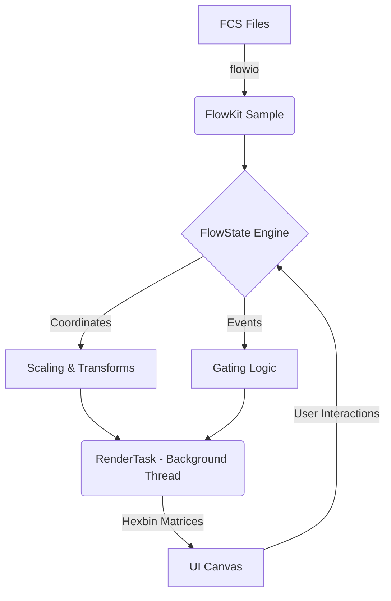

# BioPro Flow Cytometry Workspace

A high-performance, scientist-centric flow cytometry analysis module for the BioPro platform. This plugin is designed to provide an extensible, mathematically rigorous alternative to traditional commercial flow cytometry software, offering advanced workflow automation and strict adherence to established flow cytometry algorithms.

## Features

### Workspace Paradigm
- **Tri-pane Layout**: Synchronized Views for Groups & Sample Tree, Graphic Canvas, and Properties & Statistics.
- **Context-Aware Tooling**: Dedicated interfaces for Compensation, Hierarchical Gating, and Statistical Reporting.
- **Non-Linear Workflows**: Fully interactive and state-driven environment devoid of restrictive wizard-based paths.

### Analysis Engine (Powered by FlowKit)
- **FCS Standards Compliance**: Native support for Flow Cytometry Standard (FCS) versions 2.0, 3.0, and 3.1.
- **Mathematical Transforms**: Implementation of true Logicle (biexponential) transforms (Parks et al., 2006) leveraging C-extensions for performance, alongside standard linear and logarithmic scales. No mathematical approximations are utilized.
- **Algorithmic Compensation**: Automated spillover matrix computation derived from single-stain controls, applied via matrix inversion.
- **Dimensional Gating**: Support for multi-dimensional geometric isolation (Rectangle, Polygon, Ellipse, Quadrant, Range) organized in a hierarchical tree structure.
- **Statistical Extraction**: Comprehensive calculation of over 13 statistical parameters (e.g., Mean, MFI, CV, % Parent, % Total).

### Scientist-Centric Automation
- **Metadata Tagging**: Semantic role assignment for samples (Unstained, Single-Stain, FMO Control, Isotype Control, Full Panel).
- **Marker Synchronization**: Explicit mapping of Biological Marker to Fluorophore to Channel, featuring automated axis labeling.
- **Workflow Serialization**: JSON-serializable experimental templates enabling reproducible research and scalable application across datasets.
- **Algorithmic Boundary Detection**: Automated 99th percentile boundary detection derived from FMO (Fluorescence Minus One) controls.

### Visualization Modalities
- **Pseudocolor (Hexbin Density)**: Canonical high-performance density-style visualization.
- **Dot Plot**: Subsampled scatter visualization for outlier detection.
- **Contour**: 2D topological histogram visualization incorporating gaussian smoothing.
- **Density**: Kernel Density Estimation (KDE).
- **Histogram**: 1-D density distribution.
- **CDF**: Cumulative Distribution Function plotting.

### Advanced Analytics (In Progress)
- **Dimensionality Reduction**: UMAP projections with interactive history tracking, configurable topologies, and channel selection.
- **Discovery**: Planned integration for automated clustering (e.g., HDBSCAN), cluster marker profiling, and visual back-gating.

## Dependencies

This plugin requires the following packages to be present within the BioPro Core execution environment:

```text
flowkit       # FCS I/O, transforms, compensation, GatingML
flowio        # FCS binary parsing
flowutils     # C-extension mathematical transforms
numpy         # Matrix operations
pandas        # Tabular data structures
matplotlib    # Canvas rendering
scipy         # Statistical functions
```

## Documentation

Comprehensive documentation is hosted on GitHub Pages: **[BioPro Flow Cytometry Documentation](https://KalaimaranB.github.io/BioPro-flow-cytometry)**

The repository documentation is strictly separated into user-facing operational guides and engineering architectural references.

### 1. User Documentation
Operational instructions for researchers conducting analyses.
- [Knowledge Hub Overview](./docs/index.md)
- [Getting Started Guide](./docs/user/01_GETTING_STARTED.md)
- Ribbon Guides:
  - [Workspace](./docs/user/02_WORKSPACE_RIBBON.md) | [Compensation](./docs/user/03_COMPENSATION_RIBBON.md) | [Gating](./docs/user/04_GATING_RIBBON.md)
  - [Pipeline](./docs/user/05_PIPELINE_RIBBON.md) | [Statistics](./docs/user/06_STATISTICS_RIBBON.md) | [Spectral](./docs/user/07_SPECTRAL_RIBBON.md) | [UMAP](./docs/user/08_UMAP_RIBBON.md)
- [Scientific Logic & Algorithms](./docs/user/03_SCIENTIFIC_LOGIC.md)
- [Credits & Acknowledgments](./CREDITS.md)

### 2. Developer Documentation
Architectural specifications and extension guides for engineers.
- [Architecture Overview](./docs/developer/00_ARCHITECTURE_OVERVIEW.md)
- [API Reference](./docs/developer/01_API_REFERENCE.md)
- [UI Engine Internals](./docs/developer/02_UI_ENGINE.md)
- [Testing & Quality Assurance](./docs/developer/03_TESTING_AND_QA.md)

## High-Level Architecture

The module enforces Unidirectional Data Flow, segregating the graphical interface from the mathematical pipeline.



## References

1. Parks, D.R., Roederer, M., Moore, W.A. (2006). A new "Logicle" display method permits expanded and more intuitive graphical representation of flow cytometry data. *Cytometry Part A*, 69A:541-551. DOI: 10.1002/cyto.a.20258
2. Roederer, M. (2001). Spectral compensation for flow cytometry: Visualization artifacts, limitations, and caveats. *Cytometry*, 45:194-205.
3. White, S. et al. FlowKit: A Python toolkit for flow cytometry analysis. https://github.com/whitews/FlowKit
