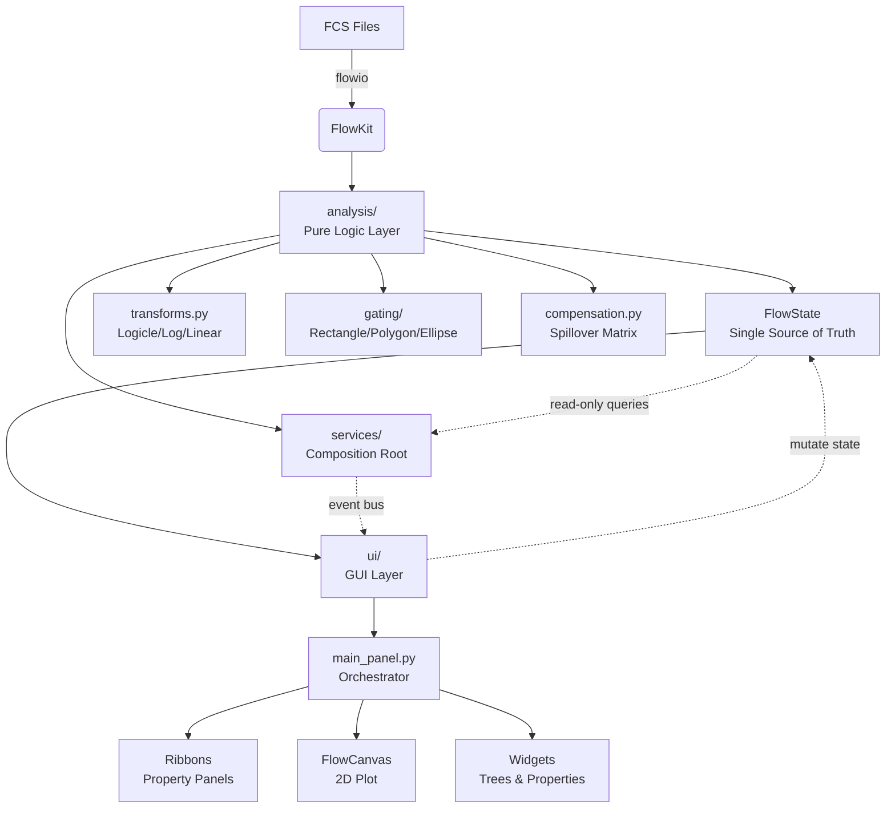
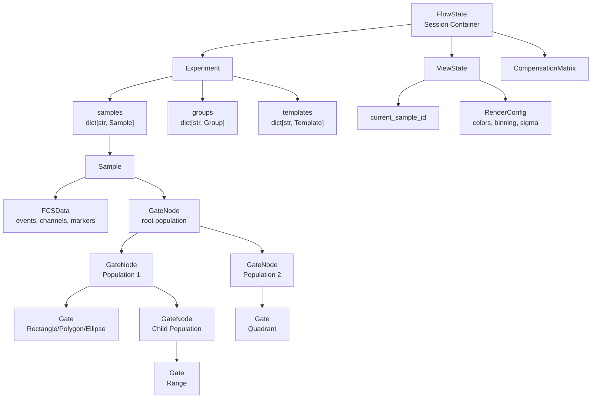
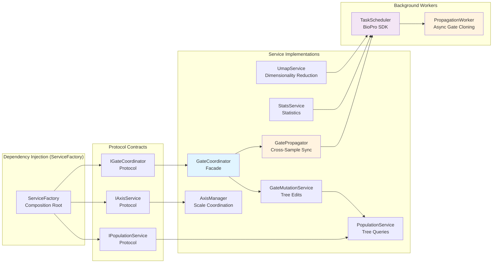
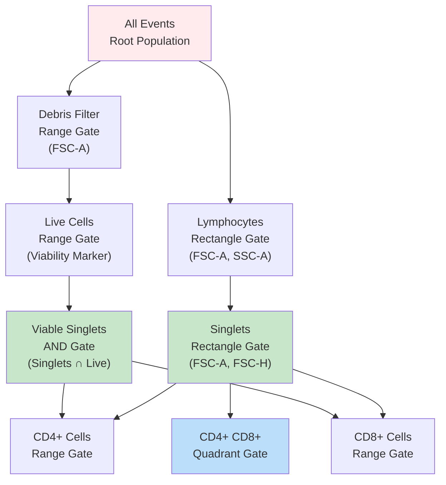
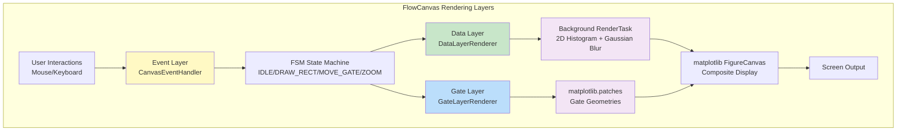

# Flow Cytometry Module — Architecture

The BioPro Flow Cytometry module enforces a strict separation of concerns, prioritizing decoupled state management and UI abstraction over monolithic, tightly coupled graphical programming paradigms.

---

## 1. The Core Dependency: FlowKit

Rather than reinventing binary FCS parsers or inefficient Python-based data transform algorithms, this module wraps **FlowKit**.

- **FCS Parsing:** `flowkit.Sample` inherently handles FCS 2.0, 3.0, and 3.1 file parsing, managing byte-orders, string decoding, and instrument metadata natively.
- **C-Extensions:** The performance-critical Logicle and biexponential transforms are executed by the associated compiled `flowutils` backend.

All interactions with FlowKit are constrained strictly to the `analysis/` directory. The UI PyQt6 widgets never import `flowkit`. Instead, they interact entirely through the intermediary `FCSData` and `Experiment` dataclass wrappers.

---

## 2. High-Level Module Architecture



### Directory Structure Definitions

- **`analysis/`**: Pure Python scalar logic containing **NO graphical dependencies**. Houses all mathematics, transforms, gating, and statistical computation.
- **`ui/`**: The View layer containing PyQt6 orchestrators, matplotlib canvases, interactive tools, and settings dispatchers. Depends on `analysis/` but `analysis/` never imports from `ui/`.
- **`workflows/`**: Pre-built JSON workflow templates for reproducible protocols.

---

## 3. Data Model Architecture



**Key Observations:**
- Each sample maintains its **independent gate tree** (no shared structure).
- Gate trees form a **DAG** (Directed Acyclic Graph), not a tree, because populations can have multiple parents (for boolean logic).
- `FlowState` is the **single source of truth**—all mutations flow through it, ensuring consistency.

---

## 4. Service Layer & Dependency Injection

The module uses a **Protocol-based dependency injection pattern** to decouple domain logic from UI layer.



### 12 Core Services

| Service | File | Responsibility | Stateful? |
|---------|------|-----------------|-----------|
| **GateCoordinator** | gate_coordinator.py | Facade for all gating operations; orchestrates mutation service + propagator | Partial (holds propagator) |
| **GateMutationService** | gate_mutation_service.py | Domain model edits (add/remove/modify gates); re-computation triggers | Stateless (uses passed state) |
| **PopulationService** | population_service.py | Population tree queries & traversal; event extraction; node lookup | Stateless (queries state) |
| **GateSelectionService** | gate_selection_service.py | Track user-selected population; publish selection events | Minimal (current selection) |
| **AxisManager** | axis_manager.py | Per-channel scale management; auto-range computation; transform coordination | Stateless (queries state) |
| **StatsService** | stats_service.py | Statistics computation orchestration; schedules on background task queue | Stateless |
| **GatingService** | gating_service.py | Cross-sample gate operations (clone, copy to group) | Stateless |
| **UmapService** | umap_service.py | UMAP job scheduling; results caching; async execution | Partial (caching) |
| **DataLoaderService** | data_loader_service.py | FCS file loading coordination; progress tracking | Stateless |
| **GateEventPublisher** | gate_event_publisher.py | Gate lifecycle event broadcasting (GATE_CREATED, GATE_DELETED, etc.) | Stateless |
| **NamingService** | naming.py | Unique name generation; collision avoidance for gates | Stateless |
| **GatePropagator** | gate_propagator.py | Cross-sample gate auto-update with 200ms debouncing; background propagation | Partial (debounce buffer) |

### Service Wiring Example

```python
# In composition_root.py (ServiceFactory)
def __init__(self, flow_state, parent=None):
    self.flow_state = flow_state
    
    # Build services with explicit dependencies
    self._services = {
        'axis_manager': AxisManager(flow_state),
        'population_service': PopulationService(flow_state),
        'gate_mutation_service': GateMutationService(flow_state),
        'gate_selection_service': GateSelectionService(),
        'gate_event_publisher': GateEventPublisher(),
    }
    
    # Compose higher-level facades
    gate_propagator = GatePropagator(
        flow_state,
        task_scheduler=parent.history_manager.task_scheduler
    )
    
    self._services['gate_coordinator'] = GateCoordinator(
        gate_mutation_service=self._services['gate_mutation_service'],
        population_service=self._services['population_service'],
        gate_propagator=gate_propagator,
        event_publisher=self._services['gate_event_publisher']
    )
    
    # UI layer depends on protocols, not concrete classes
    # IGateCoordinator gate_coordinator = self._services['gate_coordinator']
```

---

## 5. Gating Architecture: Directed Acyclic Graph (DAG)

Unlike commercial cytometers that use rigid hierarchical trees, this module implements a **Directed Acyclic Graph (DAG)** for population definitions.



**Key Features:**
- **Multi-Parent Support**: Nodes can have multiple parents (e.g., "Viable Singlets" has 2 parents).
  - This enables boolean logic: `(Singlets) AND (Viable Cells)`.
  - Computed via `DagEvaluator.evaluate()` with topological sort + mask combination.
  
- **Automatic Propagation**: When a gate is modified on one sample, `GatePropagator` clones the updated tree to sibling samples with 200ms debouncing.
  
- **Lazy Statistics**: Population statistics are computed on-demand during DAG evaluation, cached per node.

---

## 6. Layered Graphical Design (SOLID)

To prevent the "God Object" anti-pattern, the `FlowCanvas` rendering engine is decomposed into three specialized layers:



**Layer Responsibilities:**
1. **Event Layer (`CanvasEventHandler`)**: Captures mouse/keyboard input and drives the Finite State Machine.
   - States: `IDLE`, `DRAW_RECT`, `DRAW_ELLIPSE`, `DRAW_POLY`, `MOVE_GATE`, `ZOOM`.
   - Ensures robust interaction without nested conditionals.

2. **Data Layer (`DataLayerRenderer`)**: Renders pure event visualization (pseudocolor, histogram, contour).
   - Communicates with background `RenderTask` to compute matrices asynchronously.
   - Never blocks the UI thread.
   
3. **Gate Layer (`GateLayerRenderer`)**: Overlays interactive gating geometries.
   - Manages `matplotlib` artists (patches, lines, labels).
   - Updates independently from data layer for performance isolation.

**Benefit**: A logic error in gate geometry calculation does **not** crash the background rendering pipeline, and vice-versa.

---

## 7. Unidirectional Data Flow

The module enforces **unidirectional data flow** through the `FlowState`:

```mermaid
graph LR
    USER["User Action<br/>Click, Drag, Slider"]
    
    USER --> VIEW["UI Component<br/>RenderSettingsPanel"]
    
    VIEW --> MUTATE["Mutate FlowState<br/>state.render_config.sigma = 1.5"]
    
    MUTATE --> PUBLISH["Publish Event<br/>EVENT_RENDER_CONFIG_CHANGED"]
    
    PUBLISH --> LISTEN["Event Listeners<br/>MainPanel, FlowCanvas"]
    
    LISTEN --> REACT["React to Change<br/>FlowCanvas.on_render_config_changed"]
    
    REACT --> RENDER["Schedule RenderTask<br/>Background computation"]
    
    RENDER --> DISPLAY["Update Canvas<br/>Repaint display"]
    
    style MUTATE fill:#ffccbc
    style PUBLISH fill:#fff9c4
    style LISTEN fill:#c8e6c9
    style RENDER fill:#b2dfdb
    style DISPLAY fill:#bbdefb
```



**Pipeline Example: Pseudocolor Smoothing Adjustment**
1. User adjusts sigma slider in `PseudocolorSettingsPanel`.
2. Panel updates `FlowState.render_config.sigma_scaling = 2.0`.
3. Panel publishes `RENDER_CONFIG_CHANGED` event.
4. `FlowCanvas` listener intercepts event.
5. `FlowCanvas` spawns new `RenderTask(render_config=updated_config)`.
6. Background thread computes 2D histogram with new Gaussian blur.
7. Upon completion, `RenderTask` emits signal to repaint canvas.
8. Canvas composite updates on next matplotlib draw cycle.

---

## 8. Event Bus Architecture

The module integrates with **BioPro's Central Event Bus** for loose coupling between components.

```
CentralEventBus Topics:

Gate Lifecycle
  └── gate.created(sample_id, node_id, gate_type, name)
  └── gate.deleted(sample_id, node_id)
  └── gate.renamed(sample_id, node_id, new_name)
  └── gate.modified(sample_id, node_id, param_changes)
  └── gate.propagated(samples_affected, gate_id)
  └── gate.selected(sample_id, node_id)
  └── gate.deselected()

Population Events
  └── population.selection_changed(node_id)
  └── population.hierarchy_changed()

Rendering Events
  └── render.config_changed(param_name, new_value)
  └── render.mode_changed(new_mode: DisplayMode)
  └── render.completed()

Axis Events
  └── axis.params_changed(sample_id, x_param, y_param)
  └── axis.range_changed(channel, min, max)
  └── axis.transform_changed(channel, new_transform)

Sample Events
  └── sample.loaded(sample_id, file_path)
  └── sample.selected(sample_id)
  └── sample.role_changed(sample_id, new_role)

Statistics Events
  └── stats.computed(sample_id, node_id, stat_values)
  └── stats.invalidated()

Compensation Events
  └── compensation.matrix_loaded(matrix, source)
  └── compensation.applied(samples_affected)

UMAP Events
  └── umap.job_started(sample_id, params)
  └── umap.job_completed(results)
  └── umap.job_failed(error)
```

---

## 9. State Segregation & FlowState Architecture

The module utilizes a **centralized FlowState** object as the single source of truth:

```python
@dataclass
class FlowState:
    """Single authoritative state container for entire session."""
    
    # Domain Models
    experiment: Experiment                 # All samples, groups, templates
    compensation: CompensationMatrix | None  # Applied spillover matrix
    
    # Rendering Configuration (Centralized)
    render_config: RenderConfig           # Bins, sigma, colormap, quality
    
    # Current User Context
    current_sample_id: str                # Active sample for plotting
    active_x_param: str                   # X-axis channel
    active_y_param: str                   # Y-axis channel
    active_display_mode: DisplayMode      # Pseudocolor/Scatter/Histogram/Contour
    
    # Additional State
    axis_scales: dict[str, AxisScale]    # Per-channel transform config
    selection_state: SelectionState       # Currently selected gate nodes
    animation_state: AnimationState       # UMAP/gate animation state
```

**State Mutation Pipeline:**
```
User adjusts Logicle M parameter in TransformDialog
  ↓
Dialog updates: state.axis_scales['FSC-A'].logicle_m = 5.0
  ↓
Dialog publishes: AXIS_TRANSFORM_CHANGED event
  ↓
CoordinateMapper updates internally
  ↓
FlowCanvas listener redraws with new transform
  ↓
All overlaid gates re-transformed and redrawn
  ↓
Gate geometry visually updates in place
```

---

## 10. Sub-System Specifications

- **[Enhanced API Reference](./01_API_REFERENCE.md)**: Gate types, statistics, transforms, services.
- **[Services & Dependency Injection](./04_SERVICES_AND_DEPENDENCY_INJECTION.md)**: Complete service layer architecture.
- **[Gating & Compensation Deep Dive](./05_GATING_AND_COMPENSATION_DEEP_DIVE.md)**: DAG evaluation, spillover matrix algorithms.
- **[Transforms & Scaling](./06_TRANSFORMS_AND_SCALING.md)**: Logicle mathematics, auto-ranging, coordinate mapping.
- **[Rendering & Visualization](./07_RENDERING_AND_VISUALIZATION.md)**: Pseudocolor algorithm, layer architecture, async rendering.
- **[Data Flow & Signal Connections](./08_DATA_FLOW_AND_SIGNAL_CONNECTIONS.md)**: Complete workflows with diagrams.
- **[UI Engine & Rendering](./02_UI_ENGINE.md)**: Existing: Canvas FSM, node pipeline, settings dialogs.
- **[Testing & QA](./03_TESTING_AND_QA.md)**: Unit, integration, and functional test patterns.

---

## 🔬 Core References
- **Parks, D.R., et al. (2006)**. A new "Logicle" display method. *Cytometry Part A*, 69A:541-551.
- **Roederer, M. (2001)**. Spectral compensation for flow cytometry. *Cytometry*, 45:194-205.
- **FlowKit**: [whitews/FlowKit](https://github.com/whitews/FlowKit) — Python flow cytometry analysis toolkit.
- **Design Patterns**: SOLID principles (Single Responsibility, Open/Closed, Liskov Substitution, Interface Segregation, Dependency Inversion).
