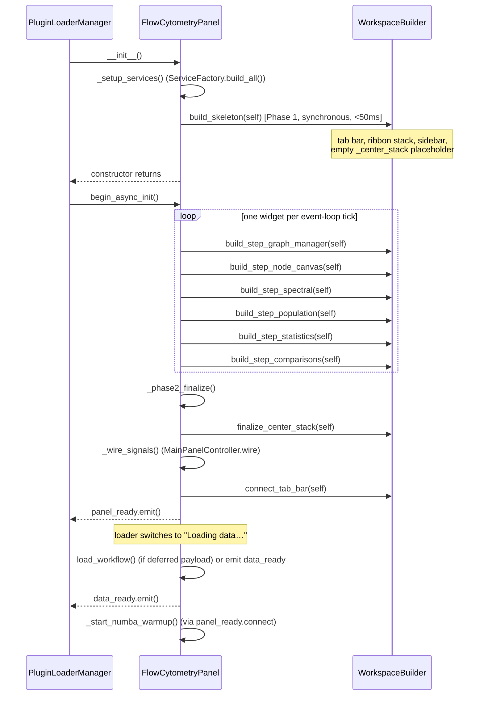
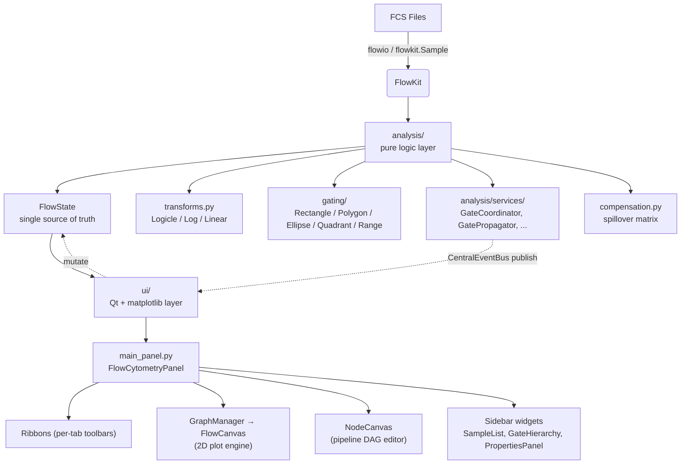
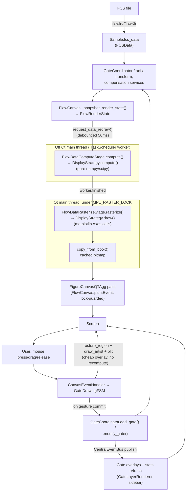
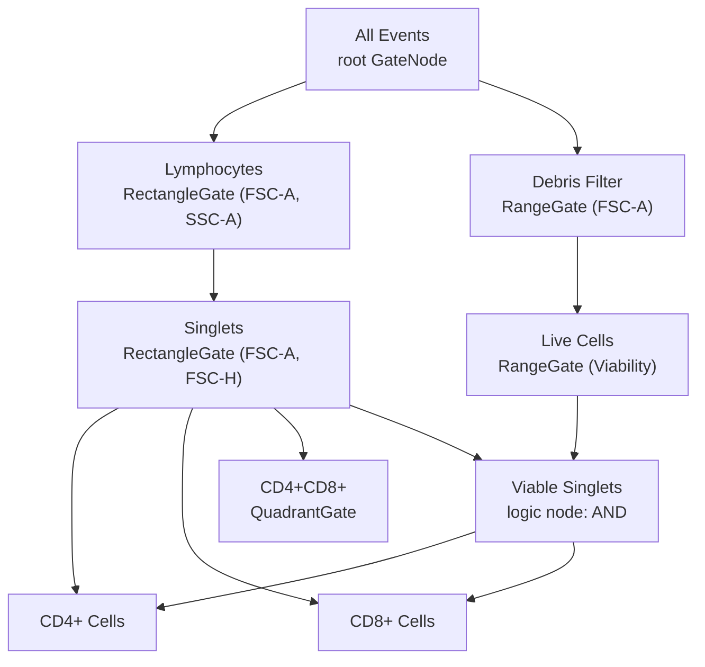

# Flow Cytometry Module — Architecture Overview

!!! note "Scope of this rewrite"
    This document was rewritten from scratch against the codebase as of the
    rendering-architecture refactor series (`LayeredMatplotlibCanvas`,
    `DisplayStrategy.compute()`/`draw()`, `MPL_RASTER_LOCK`, dirty-region node
    canvas). Every class, method, and file path below was confirmed by reading
    the source, not carried over from the previous version of this doc. See
    [`02_UI_ENGINE.md`](02_UI_ENGINE.md) and
    [`08_DATA_FLOW_AND_SIGNAL_CONNECTIONS.md`](08_DATA_FLOW_AND_SIGNAL_CONNECTIONS.md)
    for the deep dives this overview links out to.

The Karcytics Flow Cytometry module is a PyQt6 plugin, injected as the
central workspace widget by the Karcytics Hub's `ModuleManager`, that wraps
[FlowKit](https://github.com/whitews/FlowKit) for FCS parsing and transforms.
It enforces a hard boundary between a pure-Python analysis layer and a Qt/
matplotlib UI layer, and — since the rendering refactor — a second boundary
inside the UI layer itself between expensive off-thread computation and the
narrow, lock-guarded rasterization step that actually touches matplotlib.

---

## 1. The Core Dependency: FlowKit

Rather than reimplementing binary FCS parsers or Logicle/biexponential
transform math, the module wraps FlowKit:

- **FCS parsing** — `flowkit.Sample` (via `flowio`) handles FCS 2.0/3.0/3.1
  parsing: byte order, string decoding, instrument metadata.
- **C-extensions** — the performance-critical Logicle/biexponential
  transforms run through FlowKit's compiled `flowutils` backend.

All direct FlowKit/`flowio` usage is confined to
`src/karcytics_plugins/flow_cytometry/analysis/` (see `fcs_io.py`,
`fcs_loader_analysis.py`). The `ui/` package never imports `flowkit` — it
only ever sees the plugin's own `FCSData`/`Sample`/`Experiment` dataclasses.

---

## 2. Directory Structure

| Path | Contains |
|---|---|
| `analysis/` | Pure Python domain logic — **no PyQt, no matplotlib**. Gating (`gating/`), transforms (`transforms.py`), compensation (`compensation.py`), statistics, services (`analysis/services/`), the `FlowState` model (`state.py`). |
| `ui/` | PyQt6 views, matplotlib canvases, ribbons, dialogs. Depends on `analysis/`; `analysis/` never imports from `ui/`. |
| `ui/graph/` | The 2-D scatter/histogram rendering engine (`FlowCanvas`, `GraphWindow`, `GraphManager`, `renderers/`, `canvas/`). |
| `ui/widgets/node_canvas/` | The Pipeline tab's `QGraphicsScene`-based DAG editor. |
| `ui/builders/` | `WorkspaceBuilder` — the two-phase skeleton/heavy-widget construction described below. |
| `ui/ribbons/` | Per-tab toolbar widgets stacked in `_ribbon_stack`. |
| `tutorials/` | Academy course definitions (`course1.py`, `course2.py`, `course3.py`) and step validators. |

`analysis/` depending on nothing Qt-related is what lets `RenderTask`
(background thumbnail rendering, see below) and `DisplayStrategy.compute()`
run safely off the Qt main thread.

---

## 3. Two-Phase Startup: `FlowCytometryPanel`

The root widget, `FlowCytometryPanel` (`ui/main_panel.py`), is a
`PluginBase` subclass built in two phases to satisfy the Hub's "Ready Gate"
protocol — a slow synchronous `__init__` would otherwise stall the Hub's
loader UI.

**Phase 1** (`FlowCytometryPanel._setup_ui` → `WorkspaceBuilder.build_skeleton`)
builds only the structural scaffold: tab bar, ribbon stack (with all 7
ribbon widgets already constructed — they're cheap), left sidebar
(`GroupsPanel`, `SampleList`, `GateHierarchy`), an empty `_center_stack`
holding a single placeholder `QWidget`, and the `PropertiesPanel`. No
matplotlib import happens here.

**Phase 2** (`FlowCytometryPanel.begin_async_init`) chains six
`WorkspaceBuilder.build_step_*` calls through `QTimer.singleShot(0, ...)`,
one widget per Qt event-loop tick, so the Hub's loader animation keeps
rendering frames while heavy widgets — each of which imports `matplotlib`
or constructs a `QGraphicsScene` — come up one at a time. The imports for
`GraphManager`, `SpectralViewer`, `PopulationAnalysisViewer`,
`StatisticsExplorer`, and `ComparisonsViewer` are deliberately deferred
*inside* their `build_step_*` method rather than hoisted to module level —
a top-level import would make Phase 1 pay matplotlib's import cost before
the panel is even considered "ready". `finalize_center_stack` then swaps the
placeholder for the six real widgets at a fixed index contract (0 =
`GraphManager`, 1 = `NodeCanvas`, 2 = `SpectralViewer`, 3 =
`PopulationAnalysisViewer`, 4 = `StatisticsExplorer`, 5 =
`ComparisonsViewer` — see [`02_UI_ENGINE.md`](02_UI_ENGINE.md) for how the
tab bar maps onto these indices).

!!! warning "Numba warm-up ordering is load-bearing, not cosmetic"
    `_start_numba_warmup()` (pre-compiling UMAP's numba kernels) is
    deliberately wired to fire only after `panel_ready` — i.e. after all of
    Phase 2's own widget construction has finished — rather than at plugin
    load time. Numba/llvmlite JIT compilation holds the GIL through most of
    a compile; a single competing CPU-bound Python thread (such as Phase
    1/2's own construction) turned a ~3s warmup into 100s+ in practice,
    which looks identical to a hung process from outside. See the docstring
    on `_start_numba_warmup` in `main_panel.py` for the full incident
    writeup.

`WorkspaceBuilder.build_heavy`/`build` exist as synchronous convenience
wrappers around the same steps, for tests and any legacy caller that needs
one-shot construction.

---

## 4. High-Level Data Flow

`FlowState` (`analysis/state.py`) is the single mutable source of truth for
a workspace: `state.data.experiment` (samples/groups/templates),
`state.data.compensation`, `state.view` (current sample/gate selection,
`RenderConfig`). UI code reads and writes it directly; there is no
immutable-state/reducer discipline — consistency across widgets is instead
maintained by the `CentralEventBus` publish/subscribe convention described
in [`08_DATA_FLOW_AND_SIGNAL_CONNECTIONS.md`](08_DATA_FLOW_AND_SIGNAL_CONNECTIONS.md).

---

## 5. Rendering Data Flow: FCS File to Screen and Back

This is the loop that matters most for anyone touching the plot engine. It
spans `analysis/gate_coordinator.py`, `ui/graph/flow_canvas.py`, `ui/graph/canvas/`,
and the SDK's `karcytics_sdk.plugin.rendering` package.

Key points, each verified against the current source:

1. **Compute/draw split.** `DisplayStrategy` (`ui/graph/renderers/base.py`)
   is an `ABC` with two abstract methods: `compute()` — pure numpy/scipy,
   explicitly documented as "safe to run off the Qt main thread" and must
   never touch a matplotlib `Axes`/`Figure` — and `draw(ax, data, **kwargs)`
   — matplotlib `Axes` calls, which "must run under `MPL_RASTER_LOCK` on the
   thread that owns the Figure". Concrete strategies (`HistogramStrategy`,
   `CdfStrategy`, `DotPlotStrategy`, `PseudocolorStrategy`,
   `ContourStrategy`, all in `ui/graph/renderers/`) are looked up by display
   mode via `RenderStrategyFactory.get_strategy()`
   (`ui/graph/renderers/factory.py`), which falls back to `"Dot Plot"` for
   an unknown mode name.
2. **The async data layer.** `FlowCanvas` extends the SDK's
   `LayeredMatplotlibCanvas`
   (`karcytics_sdk/plugin/rendering/mpl_canvas.py`, a `FigureCanvasQTAgg`
   subclass). `FlowCanvas.redraw()` calls
   `request_data_redraw(self._snapshot_render_state(), debounce_ms=50)`,
   which debounces rapid calls (e.g. a settings slider being dragged) into
   one compute submission, then submits `FlowDataComputeStage`
   (`ui/graph/canvas/data_layer.py`) through the injected `ITaskScheduler`.
   When the worker's `finished` signal fires, `_apply_data_layer()` runs
   `FlowDataRasterizeStage.rasterize()` under `raster_lock.try_run(...)` and
   caches the result via `copy_from_bbox()`.
3. **`FlowRenderState`.** A dataclass snapshot
   (`ui/graph/canvas/data_layer.py`) captured on the Qt main thread just
   before the async submission — it holds *references*, not deep copies, to
   mutable objects like `x_scale`/`y_scale`/`flow_state`, a documented,
   pre-existing, narrow race window (same tradeoff `RenderTask` already
   makes for the node-canvas thumbnail path).
4. **`MPL_RASTER_LOCK`.** A process-wide `RasterLock` singleton
   (`karcytics_sdk/plugin/rendering/lock.py`), reentrant (`threading.RLock`)
   because matplotlib's Qt backend can re-invoke `draw()` on a thread that
   already holds the lock via `_draw_idle()`. `FlowCanvas.paintEvent()` /
   `.draw()` acquire it **non-blocking** (`try_run`) and, if busy, retry via
   `QTimer.singleShot` rather than freezing the UI thread. Only the final
   rasterize step is guarded — `compute()` work (density/KDE/histogram
   binning) stays fully parallel. `GateLayerRenderer.render()`
   (`ui/graph/canvas/gate_layer.py`) and `GateDrawingFSM`'s interactive
   preview paths (`ui/graph/gate_drawing_fsm.py`) acquire the same lock the
   same way, for the same reason — they draw matplotlib artists too.
5. **The cheap overlay layer.** Gate overlays, drag previews, and rubber
   bands never trigger a data-layer recompute. They restore the cached
   bitmap (`restore_region`) and blit a handful of artists on top — see
   `LayeredMatplotlibCanvas.draw_overlay_artists_blit()` and
   `GateDrawingFSM._apply_edit_preview()` / `_draw_rubber_band()`, all of
   which go through `canvas.raster_lock.try_run(...)`.
6. **Interactive gate drawing loop back into the model.** Mouse events
   reach `CanvasEventHandler` (`ui/graph/canvas/event_handler.py`) via
   matplotlib's `mpl_connect`, which forwards into `GateDrawingFSM`
   (states `IDLE` / `DRAWING` / `POLYGON` / `EDITING`). A completed gesture
   — drag release, polygon double-click, or an edit-drag release whose
   geometry actually changed — is the *single* point where
   `FlowCanvas.gate_created`/`gate_modified` fires and the mutation reaches
   `GateCoordinator.add_gate()`/`.modify_gate()`. Live-drag preview frames
   in between mutate the in-memory `Gate` object directly and redraw only
   the cheap overlay layer — no event is published, no stats recompute
   runs, until the gesture commits. See
   [`08_DATA_FLOW_AND_SIGNAL_CONNECTIONS.md`](08_DATA_FLOW_AND_SIGNAL_CONNECTIONS.md)
   for what happens after that mutation (event publication, undo/dirty
   tracking, propagation).

---

## 6. The Node Canvas (Pipeline Tab)

The Pipeline tab uses a completely separate rendering stack — `QGraphicsScene`/
`QGraphicsView`, not matplotlib — for the DAG editor:

- `NodeCanvas` (`ui/widgets/node_canvas/canvas_view.py`) owns a
  `DirtyTrackingGraphicsScene`/`DirtyTrackingGraphicsView`
  (`karcytics_sdk/plugin/rendering/graphics_scene.py`), which default to
  `MinimalViewportUpdate` instead of a full-viewport repaint per change.
- `CanvasManager` (`ui/widgets/node_canvas/canvas_manager.py`) is the
  logic/view bridge: it builds `NodeItem`/`EdgeItem` graphics objects from a
  sample's `GateNode` tree (BFS, so multi-parent/DAG nodes are built exactly
  once), and calls `scene.mark_dirty(item)` — never a bare `item.update()`
  — whenever a node's stats or geometry change.
- Each node's small preview plot is rendered off the Qt thread by
  `RenderTask` (`ui/graph/render_task.py`), submitted through the *same*
  `task_scheduler` used elsewhere, and cached process-wide in
  `CanvasManager`'s module-level `_ThumbnailCache` dict keyed by
  `(sample_id, node_id, geometry_hash)`. `RenderTask.run()` explicitly notes
  its own Agg rasterization must serialize behind `MPL_RASTER_LOCK` too
  ("concurrent calls cause a SIGBUS / memory corruption" on macOS ARM).

See [`02_UI_ENGINE.md`](02_UI_ENGINE.md) for the full node-canvas write-up,
including the `prepareGeometryChange()` discipline that
`DirtyTrackingGraphicsScene`'s `mark_dirty()` opt-in debug check exists to
catch.

---

## 7. Gating Architecture: Directed Acyclic Graph (DAG)

Population definitions form a DAG, not a strict tree — a node can have more
than one parent (AND/OR/NOT "logic nodes", built in the Pipeline tab).

Each `Sample` owns its own independent `gate_tree` (a `GateNode` DAG, root
named "All Events"). `analysis/compute/dag_evaluator.py`'s `DagEvaluator`
evaluates node membership via topological sort + boolean mask combination.
Gate edits on one sample can be cloned to sibling samples in the same group
by `GatePropagator` (`analysis/gate_propagator.py`), debounced — see
`services/gate_mutation_service.py`'s calls to
`coordinator.request_propagation()` after every structural edit.

---

## 8. Where to Go Next

- **[UI Engine (`02_UI_ENGINE.md`)](02_UI_ENGINE.md)** — the tab/ribbon/
  center-stack system, `FlowCanvas`'s rendering layers in full, the
  `GateDrawingFSM`, the node canvas, and render-settings dialogs.
- **[Data Flow & Signal Connections (`08_DATA_FLOW_AND_SIGNAL_CONNECTIONS.md`)](08_DATA_FLOW_AND_SIGNAL_CONNECTIONS.md)** —
  the `CentralEventBus` topic reference, `MainPanelController.wire()`, and
  full end-to-end workflow traces (draw a gate, load an FCS file, run
  Academy).
- **[Services & Dependency Injection (`04_SERVICES_AND_DEPENDENCY_INJECTION.md`)](04_SERVICES_AND_DEPENDENCY_INJECTION.md)** —
  `ServiceFactory`/`composition_root.py` and the full service inventory.
- **[Gating & Compensation Deep Dive (`05_GATING_AND_COMPENSATION_DEEP_DIVE.md`)](05_GATING_AND_COMPENSATION_DEEP_DIVE.md)**,
  **[Transforms & Scaling (`06_TRANSFORMS_AND_SCALING.md`)](06_TRANSFORMS_AND_SCALING.md)**,
  **[Rendering & Visualization (`07_RENDERING_AND_VISUALIZATION.md`)](07_RENDERING_AND_VISUALIZATION.md)** —
  algorithm-level detail for each subsystem (not owned by this rewrite pass;
  cross-check against source before relying on them).

!!! warning "Docs not covered by this rewrite"
    `01`, `03`–`07` were **not** re-verified in this pass and may still
    reference pre-refactor names (e.g. `DataLayerRenderer`, dotted event
    names like `gate.created` instead of `flow.gate.created`). Treat them as
    a starting point, not ground truth, until they're rewritten too.

---

### Core References

- Parks, D.R., et al. (2006). A new "Logicle" display method. *Cytometry Part A*, 69A:541-551.
- Roederer, M. (2001). Spectral compensation for flow cytometry. *Cytometry*, 45:194-205.
- FlowKit: [whitews/FlowKit](https://github.com/whitews/FlowKit).
