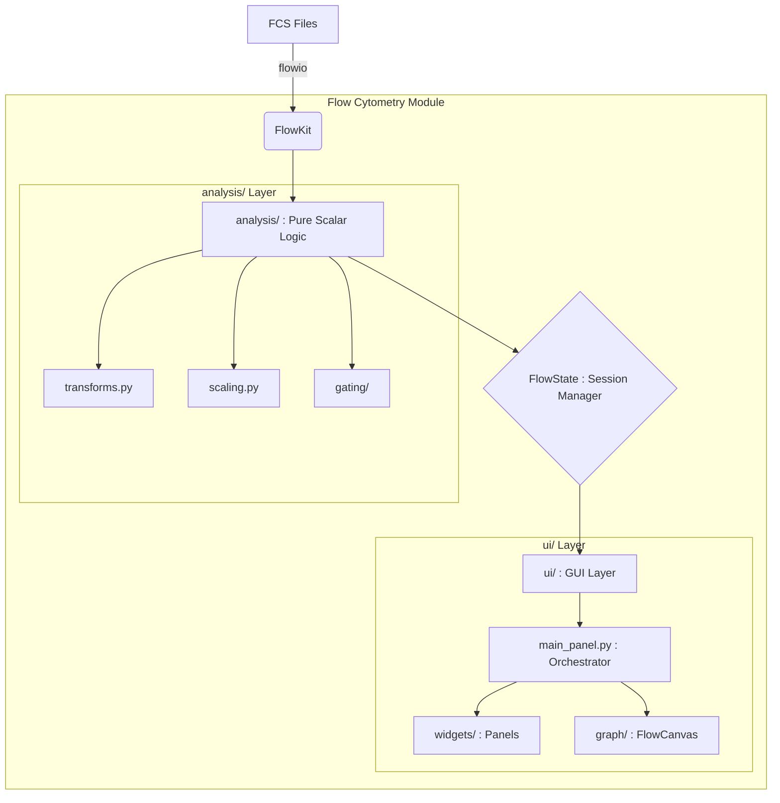

# Flow Cytometry Module — Architecture

The BioPro Flow Cytometry module enforces a strict separation of concerns, prioritizing decoupled state management and UI abstraction over monolithic, tightly coupled graphical programming paradigms.

---

## 1. The Core Dependency: FlowKit

Rather than reinventing binary FCS parsers or inefficient Python-based data transform algorithms, this module wraps **FlowKit**.

- **FCS Parsing:** `flowkit.Sample` inherently handles FCS 2.0, 3.0, and 3.1 file parsing, managing byte-orders, string decoding, and instrument metadata natively.
- **C-Extensions:** The performance-critical Logicle and biexponential transforms are executed by the associated compiled `flowutils` backend.

All interactions with FlowKit are constrained strictly to the `analysis/` directory. The UI PyQt6 widgets never import `flowkit`. Instead, they interact entirely through the intermediary `FCSData` and `Experiment` dataclass wrappers.

---

## 2. Structural Architecture



### Directory Structure Definitions

- **`analysis/`**: Pure Python scalar logic containing NO graphical dependencies.
- **`ui/`**: The View layer containing PyQt6 orchestrators, matplotlib canvases, and context-sensitive settings dispatchers.
- **`workflows/`**: Pre-built JSON workflow templates.

---

## 3. Layered Graphical Design (SOLID)

To prevent the "God Object" anti-pattern within `FlowCanvas`, the graphical engine is decomposed into three distinct, specialized layers:

1. **Data Layer (`DataLayerRenderer`)**: Responsible for pure event rendering (Pseudocolor, Histogram, etc.). It communicates with the background `RenderTask` to compute densities without blocking the primary UI thread.
2. **Gate Layer (`GateLayerRenderer`)**: Handles the interactive overlay of gating geometry. It sits on top of the data layer and manages its own `matplotlib` artists for performance isolation.
3. **Event Layer (`CanvasEventHandler`)**: Captures mouse/keyboard interaction and drives the `GateDrawingFSM` (Finite State Machine).

> [!NOTE]
> This separation ensures that a logical error in gate geometry calculation does not crash the background data rendering pipeline, and vice-versa.

---

## 4. The `FlowState` Architecture

The module utilizes Unidirectional Data Flow. The core state controller is `FlowState`.

```python
@dataclass
class FlowState:
    experiment: Experiment
    render_config: RenderConfig  # Centralized visualization parameters
    current_sample_id: str
    active_x_param: str
    active_display_mode: DisplayMode
```

**State Segregation Pipeline:**
1. The user adjusts a parameter within the `PseudocolorSettingsPanel`.
2. The panel mutates the `RenderConfig` within the global `FlowState`.
3. The panel emits a `render_settings_changed` signal across the Event Bus.
4. The `FlowCanvas` intercepts the signal, spawns a new `RenderTask` utilizing the updated configuration, and issues a repaint command upon mathematical completion.

---

## 5. Sub-System Specifications

- **[API Reference](./01_API_REFERENCE.md)**: Detailed signatures for Gating, Scaling, and Configuration models.
- **[UI Engine & Rendering](./02_UI_ENGINE.md)**: Mechanics of the asynchronous pipeline and strategy-based rendering components.
- **[Testing & QA](./03_TESTING_AND_QA.md)**: Guidelines for executing the unit and integration test suites.

---

## 🔬 Core References
- **Parks, D.R., et al. (2006)**. A new "Logicle" display method. *Cytometry Part A*.
- **FlowKit Documentation**: [GitHub Repository](https://github.com/whitews/FlowKit)
