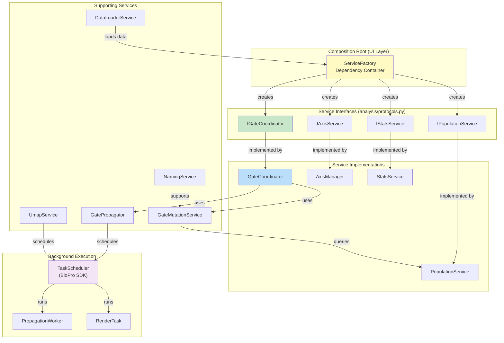

# Services & Dependency Injection Architecture

This document explains the service layer architecture, dependency injection pattern, and how all 12 core services work together to manage the flow cytometry analysis session.

---

## 1. Dependency Injection Pattern

The module uses **Protocol-based dependency injection** (structural subtyping) to achieve loose coupling between UI and analysis layers.



### Composition Root Pattern

The `ServiceFactory` (in `ui/composition_root.py`) is responsible for:
1. Creating all service instances with proper lifecycle.
2. Wiring dependencies between services.
3. Registering services with the UI framework.
4. Managing service availability.

```python
# Example: Composition Root (simplified)
class ServiceFactory:
    def __init__(self, flow_state: FlowState, parent_widget):
        self.flow_state = flow_state
        self._services = {}
        
        # Build stateless services (pure functions)
        self._services['axis_manager'] = AxisManager(flow_state)
        self._services['population_service'] = PopulationService(flow_state)
        
        # Build domain services
        gate_mutation = GateMutationService(flow_state)
        self._services['gate_mutation_service'] = gate_mutation
        
        # Build propagator (background worker)
        propagator = GatePropagator(
            flow_state,
            task_scheduler=parent_widget.task_scheduler
        )
        
        # Build facade (highest-level abstraction)
        coordinator = GateCoordinator(
            gate_mutation_service=gate_mutation,
            population_service=self._services['population_service'],
            gate_propagator=propagator,
            event_publisher=GateEventPublisher()
        )
        self._services['gate_coordinator'] = coordinator
        
        # UI layer gets only protocols
        # IGateCoordinator gate_coordinator = self._services['gate_coordinator']
    
    def get(self, service_name: str):
        return self._services.get(service_name)
```

---

## 2. Service Overview Table

| Service | File | Role | Stateful? | Key Responsibility |
|---------|------|------|-----------|-------------------|
| **AxisManager** | analysis/axis_manager.py | Stateless | ✗ | Scale coordination, auto-range, transform mapping |
| **PopulationService** | analysis/services/population_service.py | Query | ✗ | Tree traversal, event filtering, node lookup |
| **GateMutationService** | analysis/services/gate_mutation_service.py | Domain | ✗ | Gate CRUD operations, tree edits, re-computation |
| **GateSelectionService** | analysis/services/gate_selection_service.py | Selection | ~ | Track user selection, publish events |
| **GateEventPublisher** | analysis/services/gate_event_publisher.py | Event Bus | ✗ | Broadcast gate lifecycle events |
| **GateCoordinator** | analysis/services/gate_coordinator.py | Facade | ~ | Orchestrate mutation + propagation, unified interface |
| **GatePropagator** | analysis/gate_propagator.py | Background | ~ | Cross-sample sync, 200ms debounce, worker scheduling |
| **GatingService** | analysis/services/gating_service.py | Utility | ✗ | Cross-sample gate operations (clone, copy) |
| **StatsService** | analysis/services/stats_service.py | Orchestration | ✗ | Statistics computation scheduling |
| **UmapService** | analysis/services/umap_service.py | Orchestration | ~ | UMAP job scheduling, results caching |
| **DataLoaderService** | analysis/services/data_loader_service.py | I/O | ✗ | FCS file loading, progress tracking |
| **NamingService** | analysis/services/naming.py | Utility | ✗ | Unique name generation, collision avoidance |

---

## 3. Detailed Service Specifications

### AxisManager — Scale & Transform Coordination

**Purpose:** Centralized management of per-channel axis transformations and display ranges.

```python
class AxisManager:
    def __init__(self, flow_state: FlowState):
        self.flow_state = flow_state
    
    def set_scale(self, channel: str, axis_scale: AxisScale) -> None:
        """Update transform configuration for channel."""
        self.flow_state.axis_scales[channel] = axis_scale
        publish_event('axis.transform_changed', channel=channel)
    
    def get_scale(self, channel: str) -> AxisScale:
        """Retrieve current scale for channel."""
        return self.flow_state.axis_scales.get(channel, AxisScale())
    
    def auto_range(self, channel: str, events: pd.DataFrame) -> tuple[float, float]:
        """Compute robust display range excluding outliers."""
        scale = self.get_scale(channel)
        return calculate_auto_range(events[channel], scale)
    
    def infer_scale(self, channel: str, sample: Sample) -> AxisScale:
        """Intelligently select transform based on channel type."""
        # Heuristic: If channel name contains fluorophore, use biexponential
        if any(marker in channel.lower() for marker in FLUOROPHORE_NAMES):
            return AxisScale(transform_type=TransformType.BIEXPONENTIAL)
        else:
            return AxisScale(transform_type=TransformType.LINEAR)
```

**Integration Points:**
- Called by `TransformDialog` when user changes transform.
- Calls back to `FlowCanvas` for coordinate mapper updates.
- Publishes `axis.transform_changed` event.

---

### PopulationService — Tree Queries & Event Filtering

**Purpose:** Read-only queries over the gate tree and event filtering.

```python
class PopulationService:
    def __init__(self, flow_state: FlowState):
        self.flow_state = flow_state
    
    def get_population_node(self, sample_id: str, node_id: str) -> GateNode | None:
        """Retrieve population node by ID."""
        sample = self.flow_state.experiment.samples.get(sample_id)
        if not sample:
            return None
        return self._find_node(sample.gate_tree, node_id)
    
    def iter_children(self, sample_id: str, parent_id: str) -> Iterator[GateNode]:
        """Iterate all child populations."""
        parent = self.get_population_node(sample_id, parent_id)
        if parent:
            yield from parent.children
    
    def get_gated_events(self, sample_id: str, node_id: str) -> pd.DataFrame:
        """Extract events filtered by population."""
        sample = self.flow_state.experiment.samples.get(sample_id)
        if not sample:
            return pd.DataFrame()
        
        # DAG evaluation computes boolean mask
        evaluator = DagEvaluator(sample.gate_tree)
        masks = evaluator.evaluate(sample.fcs_data.events)
        
        if node_id in masks:
            return sample.fcs_data.events[masks[node_id]]
        else:
            return pd.DataFrame()
    
    def get_population_name_path(self, sample_id: str, node_id: str) -> str:
        """Get full hierarchical path, e.g., 'Lymphocytes / CD4+T'."""
        node = self.get_population_node(sample_id, node_id)
        if not node:
            return ""
        
        path = [node.name]
        while node.parents:
            node = node.parents[0]  # Follow first parent
            if node.name != "All Events":
                path.insert(0, node.name)
        
        return " / ".join(path)
    
    def _find_node(self, root: GateNode, node_id: str) -> GateNode | None:
        """DFS to find node by ID."""
        if root.node_id == node_id:
            return root
        for child in root.children:
            result = self._find_node(child, node_id)
            if result:
                return result
        return None
```

**Key Methods:**
- `get_population_node()`: Safe tree lookup.
- `get_gated_events()`: Filter events using DAG evaluation.
- `iter_children()`: Safe iteration.
- `get_population_name_path()`: Human-readable hierarchical names.

---

### GateMutationService — Domain Model Edits

**Purpose:** All mutations to the gate tree; entry point for domain logic.

```python
class GateMutationService:
    def __init__(self, flow_state: FlowState):
        self.flow_state = flow_state
    
    def add_gate(
        self,
        sample_id: str,
        gate: Gate,
        parent_node_id: str | None = None,
        name: str | None = None
    ) -> str:
        """Add new population to tree."""
        sample = self.flow_state.experiment.samples[sample_id]
        
        # Generate unique name
        if not name:
            name = NamingService.generate_unique_name(
                gate.__class__.__name__, sample.gate_tree
            )
        
        # Create node
        new_node = GateNode(
            node_id=str(uuid.uuid4()),
            name=name,
            gate=gate,
            children=[],
            parents=[]
        )
        
        # Wire into tree
        if parent_node_id:
            parent = self._find_node(sample.gate_tree, parent_node_id)
            parent.children.append(new_node)
            new_node.parents.append(parent)
        else:
            # Add to root
            sample.gate_tree.children.append(new_node)
            new_node.parents.append(sample.gate_tree)
        
        # Re-compute statistics
        self._recompute_stats(sample)
        
        # Publish event
        publish_event('gate.created', sample_id=sample_id, node_id=new_node.node_id)
        
        return new_node.node_id
    
    def remove_gate(self, sample_id: str, node_id: str) -> None:
        """Remove population from tree."""
        sample = self.flow_state.experiment.samples[sample_id]
        node = self._find_node(sample.gate_tree, node_id)
        
        if not node:
            return
        
        # Unparent from all parents
        for parent in node.parents:
            parent.children.remove(node)
        
        # Unparent all children (move to root)
        for child in node.children:
            child.parents.remove(node)
            child.parents.append(sample.gate_tree)
            sample.gate_tree.children.append(child)
        
        # Re-compute statistics
        self._recompute_stats(sample)
        
        # Publish event
        publish_event('gate.deleted', sample_id=sample_id, node_id=node_id)
    
    def modify_gate(
        self,
        sample_id: str,
        node_id: str,
        updates: dict[str, Any]
    ) -> None:
        """Update gate parameters (position, size, rotation, etc.)."""
        sample = self.flow_state.experiment.samples[sample_id]
        node = self._find_node(sample.gate_tree, node_id)
        
        if not node or not node.gate:
            return
        
        # Update gate attributes
        for key, value in updates.items():
            if hasattr(node.gate, key):
                setattr(node.gate, key, value)
        
        # Re-compute statistics
        self._recompute_stats(sample)
        
        # Publish event
        publish_event('gate.modified', sample_id=sample_id, node_id=node_id)
    
    def rename_gate(self, sample_id: str, node_id: str, new_name: str) -> None:
        """Rename population."""
        sample = self.flow_state.experiment.samples[sample_id]
        node = self._find_node(sample.gate_tree, node_id)
        
        if node:
            node.name = new_name
            publish_event('gate.renamed', sample_id=sample_id, node_id=node_id)
    
    def _recompute_stats(self, sample: Sample) -> None:
        """Re-evaluate DAG and update all statistics."""
        evaluator = DagEvaluator(sample.gate_tree)
        masks = evaluator.evaluate(sample.fcs_data.events)
        
        # Update statistics for all nodes
        self._update_node_stats(sample.gate_tree, masks, sample.fcs_data.events)
    
    def _update_node_stats(self, node: GateNode, masks: dict, events: pd.DataFrame):
        """Recursively update node statistics."""
        if node.node_id in masks:
            gated = events[masks[node.node_id]]
            node.statistics = {
                'count': len(gated),
                'percent_parent': 100 * len(gated) / len(events),  # Simplified
            }
        
        for child in node.children:
            self._update_node_stats(child, masks, events)
```

**Key Patterns:**
- **Immutable Events**: Changes publish events rather than returning booleans.
- **Automatic Cleanup**: Handles DAG consistency (re-wiring orphaned nodes).
- **Statistics Integration**: Every mutation triggers re-computation.

---

### GateCoordinator — Facade Pattern

**Purpose:** Unified interface for UI layer; orchestrates mutation + propagation.

```python
class GateCoordinator(IGateCoordinator):
    """Facade hiding complexity of mutation + propagation."""
    
    def __init__(
        self,
        gate_mutation_service: GateMutationService,
        population_service: PopulationService,
        gate_propagator: GatePropagator,
        event_publisher: GateEventPublisher
    ):
        self.mutation_service = gate_mutation_service
        self.population_service = population_service
        self.propagator = gate_propagator
        self.event_publisher = event_publisher
    
    def add_gate(
        self,
        sample_id: str,
        gate: Gate,
        parent_node_id: str | None = None,
        name: str | None = None,
        auto_propagate: bool = True
    ) -> str:
        """Add gate; optionally propagate to sibling samples."""
        node_id = self.mutation_service.add_gate(
            sample_id, gate, parent_node_id, name
        )
        
        if auto_propagate:
            # Schedule propagation to group
            self.propagator.schedule_propagation(sample_id)
        
        return node_id
    
    # Other methods delegate to underlying services...
```

**Benefits:**
- Single point of contact for UI layer.
- Hides service complexity.
- Can inject cross-cutting concerns (logging, validation, undo/redo).

---

### GatePropagator — Cross-Sample Synchronization

**Purpose:** Automatically apply gate changes to sibling samples in the same group with debouncing.

```python
class GatePropagator:
    DEBOUNCE_MS = 200
    
    def __init__(self, flow_state: FlowState, task_scheduler):
        self.flow_state = flow_state
        self.task_scheduler = task_scheduler
        self._pending_samples = set()
        self._debounce_timer = None
    
    def schedule_propagation(self, sample_id: str) -> None:
        """Schedule propagation; debounce rapid updates."""
        self._pending_samples.add(sample_id)
        
        # Cancel existing timer
        if self._debounce_timer:
            self._debounce_timer.stop()
        
        # Schedule new timer
        self._debounce_timer = QTimer()
        self._debounce_timer.timeout.connect(self._do_propagate)
        self._debounce_timer.start(self.DEBOUNCE_MS)
    
    def _do_propagate(self) -> None:
        """Execute propagation on background thread."""
        self._debounce_timer.stop()
        
        for sample_id in self._pending_samples:
            # Get sample's group
            sample = self._find_sample(sample_id)
            if not sample or not sample.group_ids:
                continue
            
            group_id = sample.group_ids[0]
            
            # Clone gate tree to all group samples
            worker = PropagationWorker(
                self.flow_state,
                group_id,
                sample_id  # Source sample
            )
            self.task_scheduler.queue_task(worker)
        
        self._pending_samples.clear()
        publish_event('propagation.started')
```

**Key Features:**
- **Debouncing**: 200ms delay prevents thrashing while user drags gate.
- **Background Execution**: Uses BioPro SDK's `TaskScheduler`.
- **Event Publishing**: Broadcasts start and completion.

---

### StatsService — Statistics Orchestration

**Purpose:** Coordinate statistics computation; schedule on background tasks.

```python
class StatsService:
    def __init__(self, flow_state: FlowState, task_scheduler):
        self.flow_state = flow_state
        self.task_scheduler = task_scheduler
    
    def compute_statistics(
        self,
        sample_id: str,
        node_id: str,
        stat_defs: list[StatDefinition]
    ) -> dict[str, StatResult]:
        """Compute multiple statistics for population."""
        sample = self.flow_state.experiment.samples.get(sample_id)
        if not sample:
            return {}
        
        # Get gated events (read-only query)
        gated_events = PopulationService(self.flow_state).get_gated_events(
            sample_id, node_id
        )
        
        results = {}
        for stat_def in stat_defs:
            result = compute_statistic(gated_events, stat_def)
            results[stat_def.stat_type.name] = result
        
        return results
    
    def schedule_full_stats_recompute(self, sample_id: str) -> None:
        """Queue background re-computation of all statistics."""
        worker = StatisticsAnalysis(
            flow_state=self.flow_state,
            sample_id=sample_id
        )
        self.task_scheduler.queue_task(worker)
```

**Integration:** Statistics computed on background threads to avoid UI blocking on large datasets.

---

### UmapService — Dimensionality Reduction Orchestration

**Purpose:** Manage UMAP job scheduling, caching, and result retrieval.

```python
class UmapService:
    def __init__(self, flow_state: FlowState, task_scheduler):
        self.flow_state = flow_state
        self.task_scheduler = task_scheduler
        self._umap_results_cache = {}
        self._active_jobs = {}
    
    def schedule_umap(
        self,
        sample_id: str,
        channel_selection: list[str],
        n_neighbors: int = 15,
        min_dist: float = 0.1
    ) -> str:
        """Schedule UMAP computation; return job ID."""
        job_id = str(uuid.uuid4())
        
        worker = UmapAnalysis(
            flow_state=self.flow_state,
            sample_id=sample_id,
            channel_selection=channel_selection,
            n_neighbors=n_neighbors,
            min_dist=min_dist
        )
        
        self._active_jobs[job_id] = worker
        self.task_scheduler.queue_task(worker)
        
        publish_event('umap.job_started', job_id=job_id)
        return job_id
    
    def get_umap_results(self, sample_id: str) -> dict | None:
        """Retrieve cached UMAP results for sample."""
        return self._umap_results_cache.get(sample_id)
    
    def cache_results(self, sample_id: str, results: dict) -> None:
        """Store UMAP results in memory."""
        self._umap_results_cache[sample_id] = results
        publish_event('umap.results_cached', sample_id=sample_id)
```

---

## 4. Service Usage Patterns

### Pattern 1: Stateless Query Service

```python
# Query service: no side effects
population_service = ServiceFactory.get('population_service')
events = population_service.get_gated_events(sample_id='s1', node_id='n123')
# Safe to call multiple times; returns same data
```

### Pattern 2: Domain Service with Event Publishing

```python
# Mutation service: triggers side effects via events
gate_mutation = ServiceFactory.get('gate_mutation_service')
gate_mutation.add_gate(
    sample_id='s1',
    gate=RectangleGate(...),
    name='Lymphocytes'
)
# Publishes: gate.created event
# UI listeners respond to event
```

### Pattern 3: Orchestration Service with Background Tasks

```python
# Orchestration service: schedules background work
umap_service = ServiceFactory.get('umap_service')
job_id = umap_service.schedule_umap(
    sample_id='s1',
    channel_selection=['BV421', 'PE', 'APC']
)
# Returns immediately; computation happens asynchronously
# Listen for 'umap.job_completed' event
```

---

## 5. Protocol Contracts

All services are defined via **Protocol** interfaces in `analysis/protocols.py`:

```python
@runtime_checkable
class IGateCoordinator(Protocol):
    """Facade for all gating operations."""
    
    def add_gate(self, sample_id, gate, parent_node_id=None, name=None) -> str:
        ...
    
    def remove_gate(self, sample_id, node_id) -> None:
        ...
    
    def modify_gate(self, sample_id, node_id, updates) -> None:
        ...

# UI layer depends on protocol, not implementation
gate_coordinator: IGateCoordinator = service_factory.get('gate_coordinator')
```

**Benefits:**
- Loose coupling: UI depends on abstractions, not concrete classes.
- Testability: Easy to mock protocols for unit tests.
- Extensibility: Can swap implementations without changing UI.

---

## 6. Testing Services

### Unit Test Example

```python
def test_gate_mutation_service():
    # Arrange
    flow_state = create_test_flow_state()
    service = GateMutationService(flow_state)
    sample_id = list(flow_state.experiment.samples.keys())[0]
    
    # Act
    gate = RectangleGate('FSC-A', 'SSC-A', 0, 100000, 0, 80000, 'Lymph')
    node_id = service.add_gate(sample_id, gate)
    
    # Assert
    sample = flow_state.experiment.samples[sample_id]
    node = find_node_by_id(sample.gate_tree, node_id)
    assert node is not None
    assert node.name == 'Lymph'
    assert node.statistics['count'] > 0
```

### Integration Test Example

```python
def test_gate_propagation_flow():
    # Arrange: Setup state with group of 2 samples
    flow_state = create_test_flow_state_with_group()
    coordinator = GateCoordinator(...)
    
    # Act: Draw gate on sample 1
    node_id = coordinator.add_gate(
        sample_id='s1',
        gate=RectangleGate(...),
        auto_propagate=True
    )
    
    # Wait for propagation
    coordinator.propagator.wait_for_completion()
    
    # Assert: Gate should exist on sample 2
    s2_node = population_service.get_population_node('s2', node_id)
    assert s2_node is not None
    assert s2_node.gate.x_min == coordinator.gate_coordinator...
```

---

## 7. Adding Custom Services

To extend the module with custom services:

1. **Define Protocol**:
```python
@runtime_checkable
class IMyService(Protocol):
    def my_operation(self, data: pd.DataFrame) -> Any:
        ...
```

2. **Implement Service**:
```python
class MyService:
    def __init__(self, flow_state: FlowState):
        self.flow_state = flow_state
    
    def my_operation(self, data: pd.DataFrame) -> Any:
        ...
```

3. **Register in Composition Root**:
```python
class ServiceFactory:
    def __init__(self, flow_state, parent):
        ...
        self._services['my_service'] = MyService(flow_state)
```

4. **Use in UI**:
```python
my_service: IMyService = service_factory.get('my_service')
result = my_service.my_operation(data)
```

---

## References

- **[Architecture Overview](./00_ARCHITECTURE_OVERVIEW.md)**: High-level module design.
- **[API Reference](./01_API_REFERENCE.md)**: Detailed API specifications.
- **[Testing & QA](./03_TESTING_AND_QA.md)**: Test patterns and mocking strategies.
