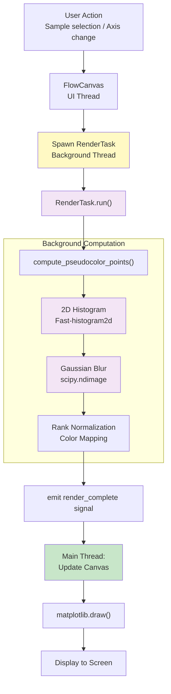

# Rendering & Visualization Architecture

Detailed technical documentation of the asynchronous rendering pipeline, layer architecture, and visualization algorithms.

---

## 1. Rendering Pipeline (Asynchronous Background Tasks)

The rendering pipeline prevents UI blocking by offloading computationally intensive matrix calculations to background threads.



### RenderTask Implementation

```python
class RenderTask(QRunnable):
    """Background rendering job; runs on ThreadPoolExecutor."""

    def __init__(
        self,
        sample: Sample,
        x_param: str,
        y_param: str,
        render_config: RenderConfig,
        axis_scales: dict[str, AxisScale],
        display_mode: DisplayMode,
    ):
        self.sample = sample
        self.x_param = x_param
        self.y_param = y_param
        self.render_config = render_config
        self.axis_scales = axis_scales
        self.display_mode = display_mode

        self.render_complete = pyqtSignal()  # Signal to UI thread

    def run(self):
        """Execute on background thread."""
        try:
            # Extract events in display space
            mapper = CoordinateMapper(self.axis_scales)
            x_display = mapper.data_to_display(
                self.x_param, self.sample.fcs_data.events[self.x_param]
            )
            y_display = mapper.data_to_display(
                self.y_param, self.sample.fcs_data.events[self.y_param]
            )

            # Render based on display mode
            if self.display_mode == DisplayMode.PSEUDOCOLOR:
                plot_data = compute_pseudocolor_points(x_display, y_display, self.render_config)
            elif self.display_mode == DisplayMode.SCATTER:
                plot_data = compute_scatter_points(x_display, y_display, self.render_config)
            elif self.display_mode == DisplayMode.HISTOGRAM:
                plot_data = compute_histogram(x_display, self.render_config)

            self.plot_data = plot_data
            self.render_complete.emit()  # Signal UI thread

        except Exception as e:
            self.error = e
            self.render_complete.emit()
```

### Asynchronous Lifecycle

```python
# In FlowCanvas (UI thread)
def on_sample_selected(self, sample_id: str):
    """User selected new sample."""
    self.current_sample = self.flow_state.experiment.samples[sample_id]

    # Cancel pending render (if any)
    if self.pending_task:
        self.pending_task.cancel()

    # Spawn background render
    task = RenderTask(
        self.current_sample,
        self.x_param,
        self.y_param,
        self.render_config,
        self.axis_scales,
        self.display_mode,
    )

    task.render_complete.connect(self.on_render_complete)
    self.thread_pool.start(task)
    self.pending_task = task

    # Show spinner/progress
    self.statusBar().showMessage("Rendering...")


def on_render_complete(self):
    """Background render finished; update display."""
    if self.pending_task.error:
        self.statusBar().showMessage(f"Error: {self.pending_task.error}")
        return

    # Update matplotlib figure with plot data
    self.data_layer_renderer.plot_data = self.pending_task.plot_data
    self.canvas.draw()
    self.statusBar().showMessage(f"Rendered {self.current_sample.name}")
```

**Benefits:**
- UI remains responsive during computation (no 500ms+ freeze).
- User can interact with other samples while rendering.
- Cancellation support (switch samples mid-render).

---

## 2. Rendering Algorithms

### Pseudocolor (Hexbin Density)

**Purpose:** High-density visualization of millions of events without overplotting.

**Algorithm:**
```python
def compute_pseudocolor_points(
    x: np.ndarray,  # Events in display space
    y: np.ndarray,
    render_config: RenderConfig,
) -> dict:
    """Compute 2D histogram + smoothing + rank colormapping."""

    # Step 1: 2D Histogram (fast spatial binning)
    nbins = int(render_config.nbins_scaling * 100)  # E.g., 256 bins

    h, xedges, yedges = np.histogram2d(
        x, y, bins=[nbins, nbins], range=[[x.min(), x.max()], [y.min(), y.max()]]
    )
    # h is nbins × nbins matrix of event counts

    # Step 2: Gaussian Blur (smoothing for aesthetic)
    sigma = render_config.sigma_scaling * 2.0  # E.g., 2-pixel blur
    h_smoothed = scipy.ndimage.gaussian_filter(h, sigma=sigma)

    # Step 3: Density Thresholding (suppress noise floor)
    threshold = render_config.density_threshold
    h_thresholded = np.where(h_smoothed > threshold, h_smoothed, 0)

    # Step 4: Rank Normalization (0-1 range)
    max_count = np.max(h_thresholded)
    if max_count > 0:
        h_normalized = h_thresholded / max_count
    else:
        h_normalized = h_thresholded

    # Convert color map names string into Matplotlib Colormap
    import matplotlib as mpl

    colormap = mpl.colormaps[render_config.colormap]  # E.g., 'hot'
    colors = colormap(h_normalized)  # RGBA tuples

    # Step 6: Extract bin centers as scatter points
    bin_centers_x = (xedges[:-1] + xedges[1:]) / 2
    bin_centers_y = (yedges[:-1] + yedges[1:]) / 2

    XX, YY = np.meshgrid(bin_centers_x, bin_centers_y)

    # Flatten to point list
    points = np.column_stack([XX.ravel(), YY.ravel()])
    colors_flat = colors.reshape(-1, 4)

    # Remove zero-density points
    valid = h_thresholded.ravel() > 0
    points = points[valid]
    colors_flat = colors_flat[valid]

    return {"points": points, "colors": colors_flat, "hist": h, "smoothed_hist": h_smoothed}
```

**Performance:**
- Histogram: O(N) — single pass
- Gaussian blur: O(B²) where B = bin count (usually 256²)
- Total: Fast enough for 10M events (< 100ms)

**Visual Output:**
```
        Pseudocolor density plot
        (contiguous regions of varying color intensity)

        High density:  Warm colors (red, white)
        Low density:   Cool colors (blue, black)
        Zero:          Transparent/absent
```

---

### Contour (2D Kernel Density Estimation)

**Purpose:** 2D topological contour lines; publication-quality visualization.

**Algorithm:**
```python
def compute_contour_plot(x, y, render_config, ax):
    """Compute contours using KDE."""

    # Step 1: Kernel Density Estimation (scipy)
    from scipy.stats import gaussian_kde

    xy = np.vstack([x, y])
    z = gaussian_kde(xy)(xy)  # Density at each event

    # Step 2: Bin events for contour
    nbins = int(render_config.nbins_scaling * 100)
    h, xedges, yedges = np.histogram2d(x, y, bins=[nbins, nbins])

    # Step 3: Smooth with Gaussian
    h_smoothed = scipy.ndimage.gaussian_filter(h, sigma=2.0)

    # Step 4: Draw contours
    XX, YY = np.meshgrid((xedges[:-1] + xedges[1:]) / 2, (yedges[:-1] + yedges[1:]) / 2)

    levels = np.linspace(h_smoothed.min(), h_smoothed.max(), 5)
    contours = ax.contour(XX, YY, h_smoothed.T, levels=levels, colors="black", alpha=0.5)
    ax.clabel(contours, inline=True, fontsize=8)
```

---

### Histogram (1D Distribution)

**Purpose:** Single-parameter density visualization.

**Algorithm:**
```python
def compute_histogram(data: np.ndarray, render_config: RenderConfig):
    """Compute 1D histogram with KDE overlay."""

    # Simple histogram binning
    nbins = int(render_config.nbins_scaling * 256)
    counts, bin_edges = np.histogram(data, bins=nbins)

    # Optional: KDE overlay
    if render_config.use_kde:
        from scipy.stats import gaussian_kde

        kde = gaussian_kde(data, bw_method="scott")
        x_smooth = np.linspace(data.min(), data.max(), 1000)
        kde_vals = kde(x_smooth)
        return {"hist": counts, "kde": kde_vals}
    else:
        return {"hist": counts}
```

---

## 3. Layer Architecture (SOLID Principles)

```mermaid
graph TB
    subgraph "FlowCanvas (Main Coordinator)"
        FC["FlowCanvas"]
    end

    subgraph "Rendering Layers"
        EL["Event Handler<br/>(CanvasEventHandler)"]
        DL["Data Layer<br/>(DataLayerRenderer)"]
        GL["Gate Layer<br/>(GateLayerRenderer)"]
    end

    subgraph "Background"
        RT["RenderTask<br/>ThreadPoolExecutor"]
    end

    subgraph "Matplotlib"
        FIG["FigureCanvas"]
        AXES["matplotlib.axes"]
    end

    FC --> EL
    FC --> DL
    FC --> GL

    EL -.->|Mouse input| FC
    DL --> RT
    RT --> FIG
    GL --> AXES
    AXES --> FIG

    style DL fill:#c8e6c9
    style GL fill:#bbdefb
    style EL fill:#fff9c4
    style RT fill:#f3e5f5
```



### Event Layer (CanvasEventHandler)

**Responsibility:** Capture user interactions; drive Finite State Machine.

```python
class CanvasEventHandler:
    """Handle mouse/keyboard events; manage drawing FSM."""

    def __init__(self, canvas: FlowCanvas):
        self.canvas = canvas
        self.state = CanvasState.IDLE
        self.transient_artists = []  # Temporary overlay (partial polygon, etc.)

    def on_mouse_press(self, event):
        """User clicked."""
        if self.state == CanvasState.IDLE and event.button == 1:
            # Start drawing rectangle
            self.state = CanvasState.DRAW_RECT
            self.rect_start = (event.xdata, event.ydata)
        elif self.state == CanvasState.DRAW_POLY:
            # Add polygon vertex
            self.polygon_vertices.append((event.xdata, event.ydata))
            self._render_overlay_layer()

    def on_mouse_move(self, event):
        """User moved mouse."""
        if self.state == CanvasState.IDLE:
            # Highlight nearest gate
            nearest = self._find_nearest_gate(event.xdata, event.ydata)
            if nearest:
                self.canvas.set_cursor("hand")
        elif self.state == CanvasState.DRAW_RECT:
            # Update rectangle overlay
            self._render_overlay_layer()

    def on_mouse_release(self, event):
        """User released mouse."""
        if self.state == CanvasState.DRAW_RECT:
            # Finalize rectangle gate
            gate = RectangleGate(
                self.x_param,
                self.y_param,
                self.rect_start[0],
                event.xdata,
                self.rect_start[1],
                event.ydata,
            )
            self.canvas.add_gate(gate)
            self.state = CanvasState.IDLE

    def _render_overlay_layer(self):
        """Draw transient geometry (partial polygon, rectangle outline)."""
        # Clear previous transient artists
        for artist in self.transient_artists:
            artist.remove()
        self.transient_artists.clear()

        # Draw partial gate preview
        if self.state == CanvasState.DRAW_POLY:
            # Draw line segments connecting vertices
            for i in range(len(self.polygon_vertices) - 1):
                line = plt.Line2D(
                    [self.polygon_vertices[i][0], self.polygon_vertices[i + 1][0]],
                    [self.polygon_vertices[i][1], self.polygon_vertices[i + 1][1]],
                    color="red",
                    linestyle="--",
                    alpha=0.5,
                )
                self.canvas.axes.add_artist(line)
                self.transient_artists.append(line)

        self.canvas.draw_idle()
```

**States:**
- `IDLE`: Default; hover for nearest gate highlighting.
- `DRAW_RECT`: Click-and-drag rectangle definition.
- `DRAW_ELLIPSE`: Click-and-drag ellipse definition.
- `DRAW_POLY`: Sequential vertex placement (right-click to finish).
- `MOVE_GATE`: Drag existing gate to reposition.
- `ZOOM`: Define zoom region.

### Data Layer (DataLayerRenderer)

**Responsibility:** Render event density visualization (pseudocolor, histogram, etc.).

```python
class DataLayerRenderer:
    """Render event scatter/density; coordinate with background RenderTask."""

    def __init__(self, axes):
        self.axes = axes
        self.scatter_artist = None

    def render(self, plot_data: dict):
        """Update data layer with pre-computed plot data."""
        if self.scatter_artist:
            self.scatter_artist.remove()

        points = plot_data["points"]
        colors = plot_data["colors"]

        self.scatter_artist = self.axes.scatter(
            points[:, 0], points[:, 1], c=colors, s=5, alpha=0.7, edgecolors="none"
        )
```

### Gate Layer (GateLayerRenderer)

**Responsibility:** Overlay interactive gate geometries (patches, labels, control points).

```python
class GateLayerRenderer:
    """Render gate geometries and control points."""

    def __init__(self, axes):
        self.axes = axes
        self.gate_artists = {}  # {node_id: matplotlib artist}

    def update_gate(self, node_id: str, gate: Gate, selected: bool = False):
        """Draw or update gate visualization."""
        # Remove old artist
        if node_id in self.gate_artists:
            self.gate_artists[node_id].remove()

        # Create appropriate artist
        if isinstance(gate, RectangleGate):
            rect = matplotlib.patches.Rectangle(
                (gate.x_min, gate.y_min),
                gate.x_max - gate.x_min,
                gate.y_max - gate.y_min,
                fill=False,
                edgecolor="red" if selected else "blue",
                linewidth=2 if selected else 1,
                linestyle="--",
            )
            self.axes.add_patch(rect)
            self.gate_artists[node_id] = rect

        # Similar for Ellipse, Polygon, etc.
```

---

## 4. Canvas State Machine (FSM)

```python
class CanvasState(Enum):
    """Finite state machine states for FlowCanvas."""

    IDLE = 0  # Default quiescent state
    DRAW_RECT = 1  # Drawing rectangle gate
    DRAW_ELLIPSE = 2  # Drawing ellipse gate
    DRAW_POLY = 3  # Drawing polygon gate (sequential vertices)
    MOVE_GATE = 4  # Translating existing gate
    ZOOM = 5  # Defining zoom region
```

---

## References

- **[Architecture Overview](./00_ARCHITECTURE_OVERVIEW.md)**: High-level design.
- **[Data Flow & Signal Connections](./08_DATA_FLOW_AND_SIGNAL_CONNECTIONS.md)**: Event flow and rendering triggers.
