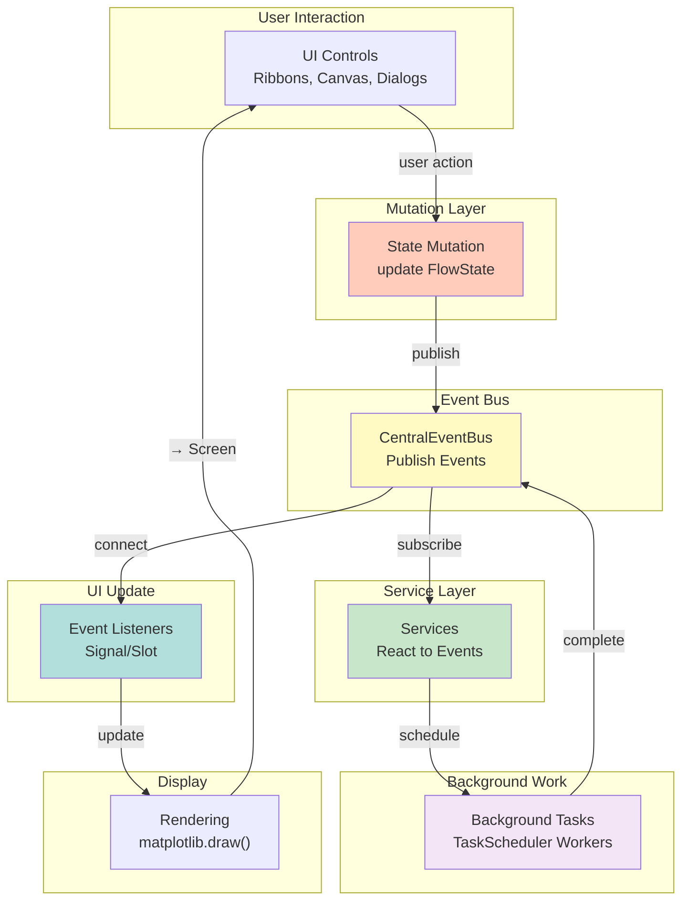
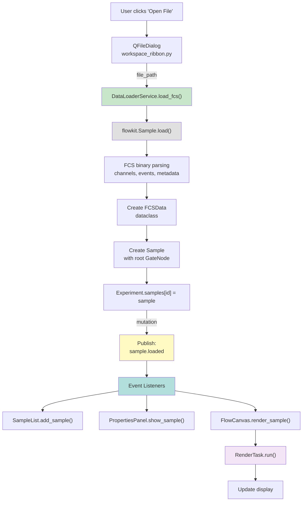
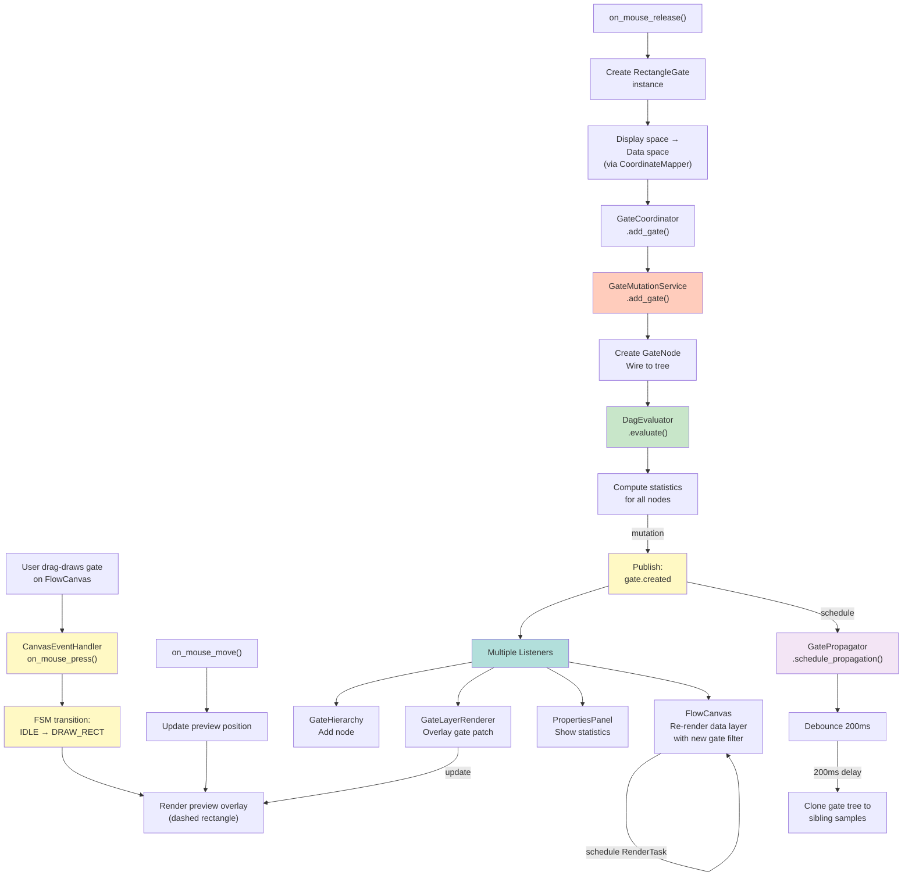
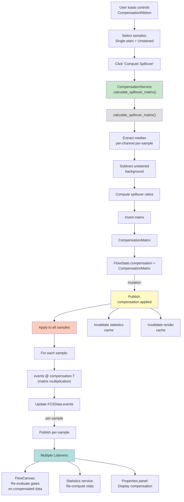

# Data Flow & Signal Connections

Complete documentation of data flow through the system, with workflow diagrams for major user operations and signal/event routing.

---

## 1. Complete Data Flow Architecture



---

## 2. Major Workflows with Detailed Signal Flow

### Workflow 1: User Opens FCS File



**Detailed Steps:**
1. User selects FCS file via dialog
2. `DataLoaderService.load_fcs()` invokes `flowkit.Sample.load()`
3. FlowKit parses binary FCS, extracts channels, events (pandas DataFrame)
4. Create `FCSData` wrapper
5. Create `Sample` with root "All Events" `GateNode`
6. Add to `Experiment.samples` (state mutation)
7. **Publish `sample.loaded` event** via Central Event Bus
8. Multiple listeners react:
   - `SampleList`: Add to tree widget
   - `PropertiesPanel`: Display sample properties
   - `FlowCanvas`: Schedule background render task
9. `RenderTask` computes pseudocolor matrix
10. On completion, update canvas display

**Key Observation:** Single state mutation triggers cascading UI updates via event system.

---

### Workflow 2: User Draws Rectangular Gate



**Detailed Steps:**
1. User clicks and drags on canvas (mouse down, move, release)
2. `CanvasEventHandler` captures events; FSM: IDLE → DRAW_RECT
3. Render dashed rectangle overlay (transient, non-blocking)
4. On mouse release:
   - Finalize gate coordinates
   - Convert from display space → data space (via `CoordinateMapper`)
   - Create `RectangleGate` instance
5. Call `GateCoordinator.add_gate()`
6. Service layer:
   - `GateMutationService.add_gate()` creates `GateNode`, wires to tree
   - `DagEvaluator` re-evaluates entire DAG
   - Compute statistics for all nodes (including new gate's counts, percentages)
7. **Publish `gate.created` event**
8. Simultaneously:
   - **Schedule propagation** (debounce 200ms) to clone gate to sibling samples
   - **Publish event** triggers multiple listeners:
     - `GateHierarchy`: Add row to tree widget
     - `GateLayerRenderer`: Draw gate patch on canvas
     - `PropertiesPanel`: Display population statistics
     - `FlowCanvas`: Re-render data layer (visualize gated subset)
9. Background propagation (after 200ms debounce):
   - Clone gate tree to all samples in group
   - Re-evaluate DAG for each sample
   - Re-compute statistics
   - Update group preview thumbnails

**Performance Note:** Debounce prevents thrashing during rapid gate edits (e.g., user dragging gate handle).

---

### Workflow 3: User Applies Compensation



**Detailed Steps:**
1. User selects single-stain controls (FITC, PE, PerCP)
2. User selects unstained control (background)
3. Click "Compute Spillover Matrix"
4. Service computes spillover matrix:
   - Extract median fluorescence per detector per control
   - Subtract unstained background
   - Compute spillover ratios (median[detector_j] / median[primary])
   - Invert matrix for compensation application
5. Store in `FlowState.compensation`
6. **Publish `compensation.applied` event**
7. For each sample in experiment:
   - Apply compensation: `compensated_events = raw_events @ inverse_matrix`
   - Update `Sample.fcs_data.events`
   - **Publish per-sample event**
8. Multiple listeners react:
   - `FlowCanvas`: Re-evaluate gates on compensated data (re-apply DAG)
   - `StatsService`: Re-compute statistics
   - `PropertiesPanel`: Display compensation applied badge
9. All plots update to show compensated data

---

## 3. Event Bus Topic Reference

All events published to `CentralEventBus`:

```
Gate Lifecycle
  gate.created(sample_id, node_id, gate_type, name)
  gate.deleted(sample_id, node_id)
  gate.renamed(sample_id, node_id, new_name)
  gate.modified(sample_id, node_id, updates_dict)
  gate.propagated(sample_ids_affected, source_sample_id)
  gate.selected(sample_id, node_id)

Sample Lifecycle
  sample.loaded(sample_id, file_path)
  sample.selected(sample_id)
  sample.role_changed(sample_id, new_role)
  sample.deleted(sample_id)

Rendering Events
  render.config_changed(param_name, new_value)
  render.mode_changed(new_display_mode)
  render.completed()

Axis Events
  axis.params_changed(sample_id, x_param, y_param)
  axis.range_changed(channel, min_val, max_val)
  axis.transform_changed(channel, new_transform_type)

Statistics Events
  stats.computed(sample_id, node_id, stat_results)
  stats.invalidated()

Compensation Events
  compensation.matrix_loaded(matrix, source)
  compensation.applied(samples_affected)

UMAP Events
  umap.job_started(job_id, sample_id)
  umap.job_completed(results)
  umap.job_failed(error_msg)

Propagation Events
  propagation.started()
  propagation.completed(samples_affected)
```

---

## 4. Signal/Slot Connections (PyQt)

### Main Panel Signal Connections

```python
class FlowCytometryPanel(PluginBase):
    def __init__(self):
        self.flow_state = FlowState(...)
        self.event_bus = BioPro.event_bus  # Central Event Bus
        
        # Subscribe to events
        self.event_bus.subscribe('gate.created', self.on_gate_created)
        self.event_bus.subscribe('sample.loaded', self.on_sample_loaded)
        self.event_bus.subscribe('render.completed', self.on_render_complete)
        self.event_bus.subscribe('compensation.applied', self.on_compensation_applied)
    
    def on_gate_created(self, event):
        """Gate creation event from event bus."""
        sample_id = event.sample_id
        node_id = event.node_id
        
        # Update UI components
        self.gate_hierarchy.refresh()
        self.properties_panel.refresh()
        self.flow_canvas.refresh_gate_overlay()
    
    def on_sample_loaded(self, event):
        """Sample loading event."""
        self.sample_list.add_sample(event.sample_id)
        self.flow_canvas.render_sample(event.sample_id)
```

### Canvas Signal Connections

```python
class FlowCanvas(FigureCanvas):
    # PyQt signals (UI → background work)
    render_started = pyqtSignal()
    render_completed = pyqtSignal(dict)  # plot_data
    
    def connect_signals(self):
        # Subscribe to events
        event_bus.subscribe('gate.created', self.on_gate_created)
        event_bus.subscribe('render.config_changed', self.on_render_config_changed)
        event_bus.subscribe('axis.transform_changed', self.on_axis_changed)
        
        # Internal RenderTask signal
        self.render_task.render_complete.connect(self.on_render_complete)
    
    def on_render_config_changed(self, event):
        """Render settings changed (sigma, bins, etc.)."""
        # Schedule re-render with new config
        self.spawn_render_task(
            self.current_sample,
            render_config=event.new_config
        )
    
    def on_render_complete(self):
        """Background RenderTask finished."""
        # Update display
        self.data_layer_renderer.update(self.render_task.plot_data)
        self.canvas.draw()
```

---

## 5. State Mutation Patterns

### Immutable State Updates

The module enforces immutable state updates via event publishing:

```python
# WRONG: Direct mutation without event
flow_state.render_config.sigma = 2.0  # ❌ Other components don't know

# CORRECT: Mutation + publication
flow_state.render_config.sigma = 2.0  # Update state
event_bus.publish('render.config_changed', param='sigma', new_value=2.0)  # Broadcast change
```

### Two-Phase Commits

Complex operations use two-phase commits with validation:

```python
# Phase 1: Attempt mutation
try:
    gate_mutation_service.add_gate(sample_id, gate)
except GeometryError as e:
    # Validation failed; don't publish event
    ui.show_error(f"Invalid gate: {e}")
    return False

# Phase 2: Publication
event_bus.publish('gate.created', sample_id=sample_id, node_id=new_id)
```

---

## References

- **[Architecture Overview](./00_ARCHITECTURE_OVERVIEW.md)**: High-level design principles.
- **[Services & Dependency Injection](./04_SERVICES_AND_DEPENDENCY_INJECTION.md)**: Service orchestration.
- **[Rendering & Visualization](./07_RENDERING_AND_VISUALIZATION.md)**: Rendering pipeline details.
