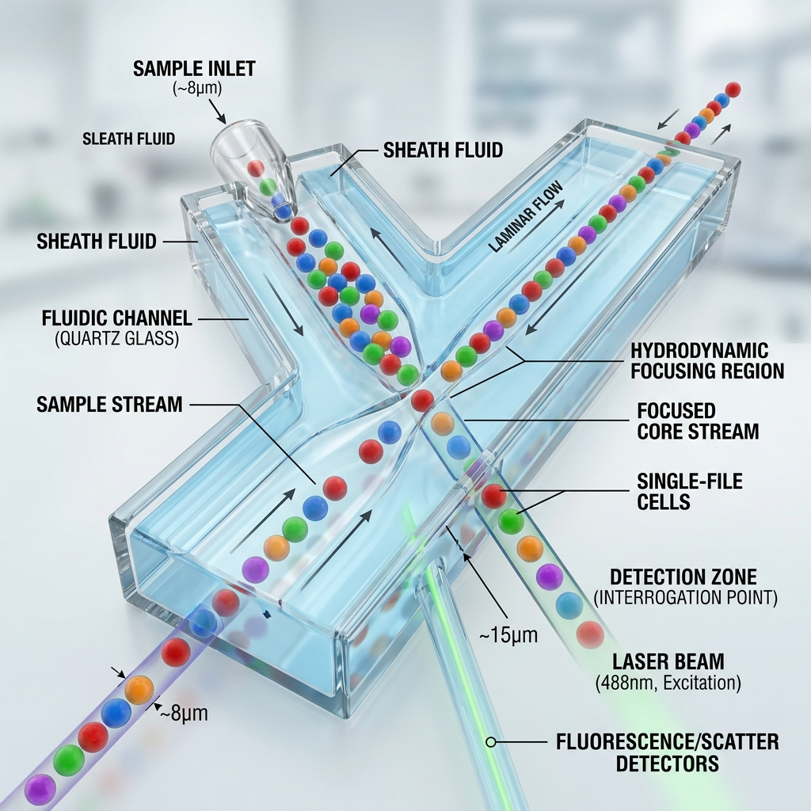
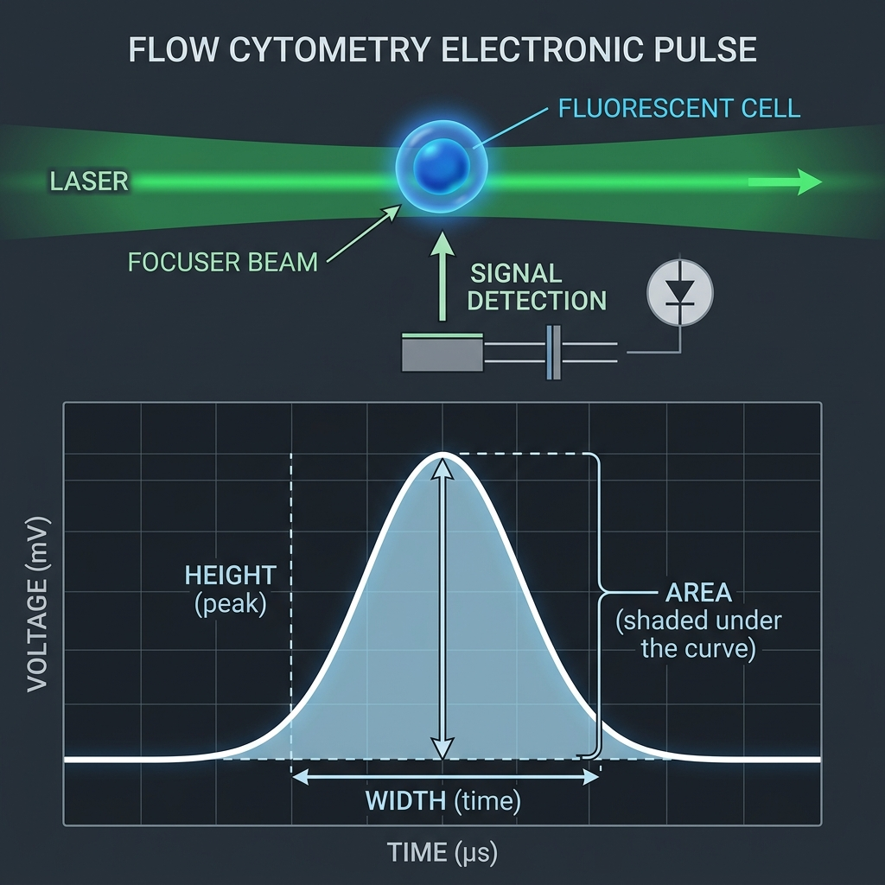
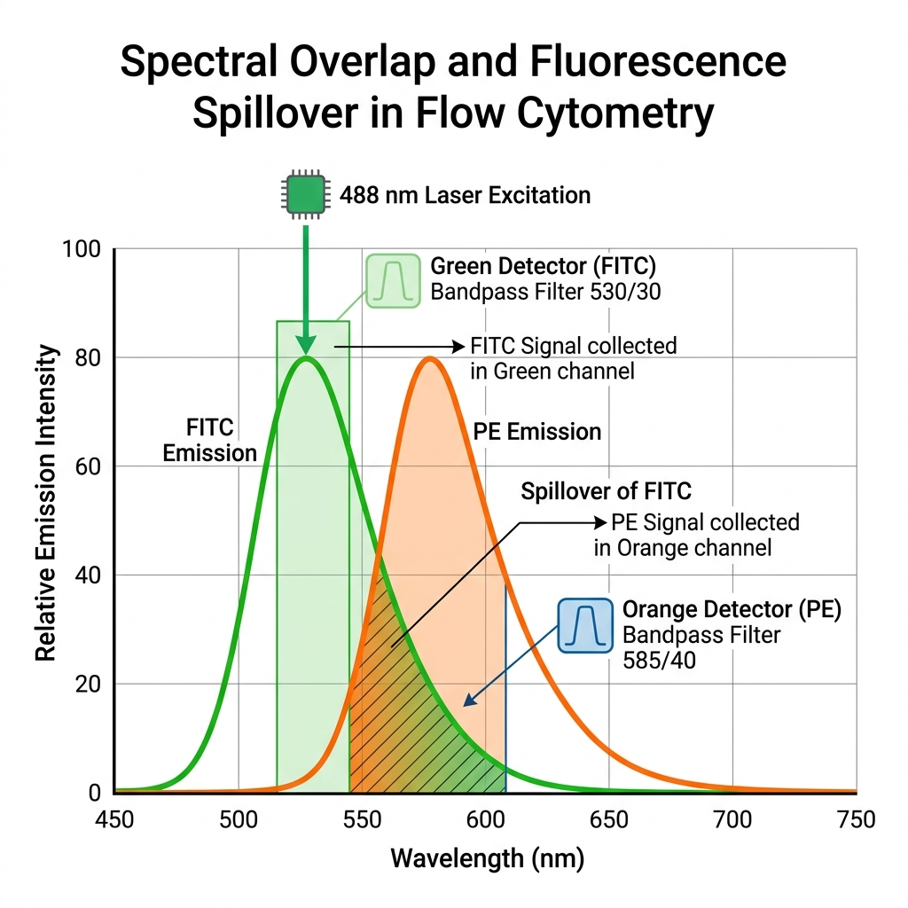

# Flow Cytometry 101: From Cells to Software

Welcome! This guide is designed for anyone who has never seen a flow cytometer before. We will demystify the "black box" of the machine and follow a single biological cell as it is transformed into a single digital dot on your screen.

---

## 🏎️ The Analogy: The High-Speed Highway Checkpoint

Think of a flow cytometer as a high-speed checkpoint on a highway. 
1. The **Cells** are cars.
2. The **Fluorophores** are license plates that glow under infrared light.
3. The **Lasers** are the high-speed cameras at the checkpoint.
4. The **Software** is the database that records every car's speed, color, and size as they zoom past at 60 miles per hour, one by one.

---

## Stage 1: The Biology (Staining)

Before we even touch the machine, we must "tag" our cells. We use **Antibodies** (biological homing missiles) conjugated to **Fluorophores** (glowing tags).

- **Lock and Key**: If a cell has a specific protein (like CD4), the antibody locks onto it.
- **The Glow**: If we hit that cell with a laser later, the tag will glow a specific color (e.g., Green or Orange).

---

## Stage 2: Fluidics (Hydrodynamic Focusing)

The machine can only look at one cell at a time. If two cells pass the laser together, the computer gets confused. We use **Hydrodynamic Focusing** to force them into a single-file line.

*Figure 1: Cells in the sample core are compressed by a surrounding sheath of fluid, forcing them to pass the laser interrogation point one by one.*

---

## Stage 3: Optics (FSC vs SSC)

As the cell passes through the laser, light bounces off it. We measure two physical traits without any staining:

| Measurement | What it tells us | Analogy |
| :--- | :--- | :--- |
| **Forward Scatter (FSC)** | The **SIZE** of the cell. | Is it a motorcycle or a semi-truck? |
| **Side Scatter (SSC)** | The **GRANULARITY** (internal complexity). | Is the truck empty or full of gravel? |

---

## Stage 4: Electronics (The Voltage Pulse)

When the laser hits a glowing tag, it emits **photons** (light particles). A detector (PMT) catches these photons and converts them into a tiny electrical current.

*Figure 2: As a cell crosses the laser, it creates a voltage pulse. The computer measures the **Area** under this curve to determine total brightness.*

---

## Stage 5: The "Bleed" Problem (Compensation)

This is the hardest concept for beginners. Imagine you have a **Green** tag and an **Orange** tag. 
Machines use "filters" to catch each color. However, the Green tag is so bright that some of its light "leaks" into the Orange detector. 

**This is called Spectral Overlap.** If we don't fix this, the computer will think a Green cell is also a bit Orange!

*Figure 3: The green emission curve (FITC) tails off into the orange detector's range. Compensation is the mathematical act of "subtracting" that known leak.*

---

## Stage 6: The Journey of One Cell (A Simulation)

Let's follow one **CD4+ T-Lymphocyte** through the system.

1.  **Staining**: You added a Green tag for CD3 and an Orange tag for CD4.
2.  **In the Machine**: The cell enters the single-file line (Fluidics).
3.  **The Laser Hit**: A blue laser strikes the cell.
    - Green light emits strongly (8,500 units).
    - Orange light emits moderately (2,100 units).
4.  **The Overlap**: Because of the "Bleed," the Orange detector actually records **3,375 units** (2,100 true units + 1,275 units of leaked Green light).
5.  **Software Fix (Compensation)**: The BioPro software knows that this specific Green tag always leaks 15% into the Orange channel. It mathematically subtracts:
    *   $3,375 - (0.15 \times 8,500) = 2,100$
    *   **The "Bleed" is gone.** Now we have the true Orange value.
6.  **The Dot**: Finally, the software takes these numbers (8,500 and 2,100) and plots a single point on your screen.

**Result**: That one biological cell is now a single **Dot** in the upper-right corner of your plot. When you do this for 100,000 cells, these dots form the "clouds" (populations) you see in the software!

---

## 🎬 Summary

- **Fluidics**: Puts cells in a line.
- **Optics**: Hits them with lasers to see size and color.
- **Electronics**: Turns light into digital numbers.
- **Compensation**: Corrects for color "bleeding."
- **Dots**: Every dot is a real cell that once lived in your test tube.

---

---

## Stage 7: Visualizing the Result (Logicle Scaling)

Standard logarithmic scales cannot display zero or negative numbers. However, in flow cytometry, **Compensation** and **Background Subtraction** often result in values that are zero or slightly negative.

### The Parks 2006 Logicle Transform
BioPro uses the **Logicle (BiExponential)** transform to solve this. It combines:
1.  **Linear scaling** around zero (to display negative values and spread).
2.  **Logarithmic scaling** for high-intensity positive values.

This allows you to see the "full spread" of a negative population alongside a multi-decade positive population on the same axis, without losing data that "hugs" the zero line.

---

## Stage 8: Density & Pseudocolor (Rank-Percentile)

When looking at 100,000+ events, individual dots begin to overlap, making it impossible to see the "core" of a population. BioPro uses **Pseudocolor Rendering** to turn these overlapping dots into a meaningful heatmap.

### The Math: Rank Percentile vs. Log-Scaling
Most software uses simple log-scaling for density, which can result in "pointy" peaks and a lot of sparse noise. BioPro implements **Rank Percentile Normalization** (the industry-standard approach) to ensure publication-quality visuals:

1. **Binning**: We divide the plot into a high-resolution grid (up to 1024x1024).
2. **Smoothing**: A Gaussian kernel "blurs" the counts, converting discrete dots into continuous clouds.
3. **Ranking**: Instead of absolute density, we calculate each event's **percentile rank**. 
    - The bottom 5% of events are snapped to pure blue (the "blue cloud").
    - The top 1% are snapped to pure red (the "hottest core").
4. **Vibrancy**: We mathematically stretch the color range so the core populations "pop" visually while maintaining a soft, continuous background.

This process ensures that whether you have 10,000 or 1,000,000 events, the plot remains visually balanced and scientifically representative.

---

## 🎨 From Dots to Discovery
While a single cell is a dot, a typical experiment contains millions of them. Use the **Render Settings** in the software to tweak these parameters (Smoothing, Detail, Point Size) to match your institutional standards or publication requirements.

---

## 🔗 Internal Links
- **[Getting Started](file:///Users/kalaimaranbalasothy/.biopro/plugins/flow_cytometry/docs/user/01_GETTING_STARTED.md)**: Tutorial for your first analysis.
- **[Analysis & Visualization Guide](file:///Users/kalaimaranbalasothy/.biopro/plugins/flow_cytometry/docs/user/02_ANALYSIS_GUIDE.md)**: How to use the Render Settings dialog.
